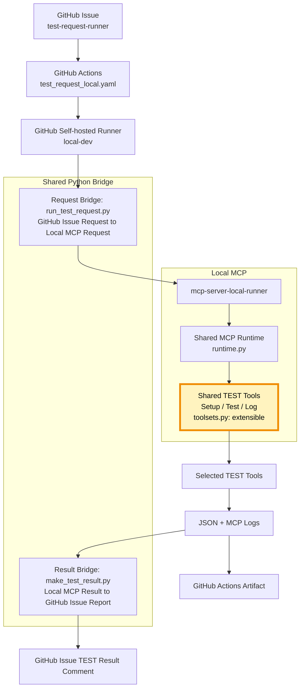
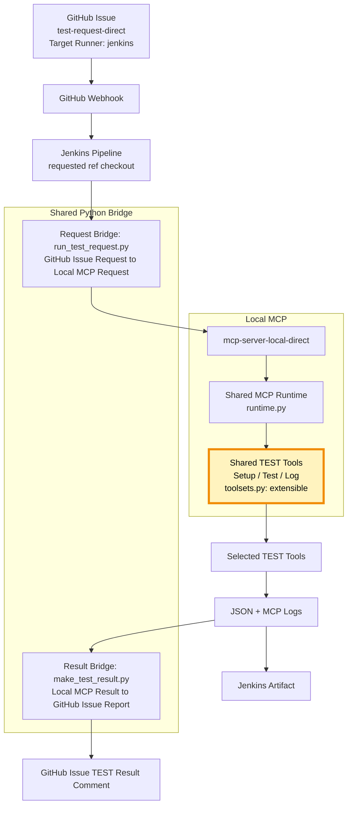

# Automation Design

<br/>

## Scope

<br/>

This document describes automation from a **Continuous Testing (CT)** point of view.

The CT design has two main flows:

1. GitHub Actions and a self-hosted runner
2. Jenkins direct execution

The purpose of this document is CT automation. CI/CD remains part of the overall automation boundary, but its flows and implementation details are omitted by default. GitHub Actions CI/CD is mentioned only to distinguish it from the Issue-based CT flows.

!!! tip "CT Documentation Scope"
    * The default scope of this document is CT.
    * Automation flows and diagrams describe CT unless a section
      explicitly states otherwise.
    * CI/CD flows and implementation details are omitted
      by default.

<br/>

---

## CI/CD and CT Responsibility

<br/>

| Area | Orchestrator | Execution Entry | Purpose |
|------|------|------|------|
| GitHub CI/CD | GitHub Actions | `.github/workflows/github_pages.yaml` | build, deploy, release |
| Runner CT | GitHub Actions | `.github/workflows/test_request_local.yaml` | Issue-based CT on a self-hosted runner |
| Direct CT | Jenkins | `Jenkinsfile` | Issue-based direct CT on a Jenkins agent |

GitHub Actions is responsible for both GitHub CI/CD orchestration and the runner CT workflow. The runner CT job itself is executed by the GitHub self-hosted runner.

!!! note "CI/CD Boundary"
    * The CI/CD row above is boundary context only.
    * CI/CD flow details are intentionally omitted from the
      remaining sections and diagrams.

<br/>

---

## CT Architecture

<br/>

CT automation is divided into two independent Main Flows. They use different automation entrypoints and different Local MCP Server entrypoints.

| Main Flow | Issue Label | Automation | Local MCP Server |
|------|------|------|------|
| GitHub Self-hosted Runner | `test-request-runner` | GitHub Actions + self-hosted runner | `mcp-server-local-runner` |
| Jenkins | `test-request-direct` | Jenkins webhook pipeline | `mcp-server-local-direct` |

Both flows share the Python Bridge, MCP runtime, toolsets, TEST result format, and GitHub Issue reporting model.

<br/>

---

## Main Flow CT

<br/>


<br/>

---

### GitHub Runner CT

<br/>

This flow is selected by the `test-request-runner` label.



Source behavior:

- The workflow listens for Issue `opened`, `edited`, and `reopened` events.
- The job runs only when the Issue has the `test-request-runner` label.
- `runs-on: [self-hosted, local-dev]` assigns the CT job to the local runner.
- `run_test_request.py` selects `mcp-server-local-runner` from the Issue's `runner` mode.
- GitHub Actions uploads JSON and logs as an artifact.
- `make_test_result.py` renders Markdown, and `actions/github-script` posts it to the Issue.

Related sources:

- `.github/ISSUE_TEMPLATE/test_request_runner.yml`
- `.github/workflows/test_request_local.yaml`
- `mcp/scripts/run_test_request.py`
- `mcp/server_local_runner/server.py`
- `mcp/scripts/make_test_result.py`

<br/>


GitHub Issue created with the runner TEST request template:


TEST result reported back to the GitHub Issue:


Sample results:

- [Closed TEST request Issues](https://github.com/JeonghunLee/local-ai-agent-mcp/issues?q=is%3Aissue%20state%3Aclosed)
- [TEST request example #21](https://github.com/JeonghunLee/local-ai-agent-mcp/issues/21)

<br/>

---

### Jenkins Direct CT

<br/>

This flow is selected by the `test-request-direct` label and the `jenkins` target runner value.



Source behavior:

- Jenkins accepts the GitHub Issue webhook and reads its number, body, repository, and labels.
- The pipeline continues only for `test-request-direct` with `Target Runner: jenkins`.
- Jenkins checks out the ref requested in the Issue before executing CT.
- `run_test_request.py` selects `mcp-server-local-direct` from the Issue's `direct` mode.
- Jenkins archives the generated result files and posts the Markdown report through the GitHub REST API.

The direct Issue template also allows `Target Runner: ai-agent`. That is a manual AI Agent execution option, not the Jenkins automated flow described here.

Related sources:

- `.github/ISSUE_TEMPLATE/test_request_direct.yml`
- `Jenkinsfile`
- `mcp/scripts/run_test_request.py`
- `mcp/server_local_direct/server.py`
- `mcp/scripts/make_test_result.py`

<br/>

---

## Shared Python Bridge

<br/>

The Python Bridge is the common adapter between automation and MCP.

<br/>

---

### Request and TEST execution

<br/>

`mcp/scripts/run_test_request.py`:

!!! note "Request Bridge Direction"
    * The request source is a GitHub TEST Request Issue.
    * GitHub Actions or Jenkins passes the Issue request to
      `run_test_request.py`.
    * The request destination is the Local MCP Server selected
      by `MCP Server Mode`.

1. Parses the GitHub Issue Form fields and selected checklist tools.
2. Validates the MCP mode and target runner.
3. Resolves the requested Git branch, tag, or commit metadata.
4. Selects the runner or direct MCP Server entrypoint.
5. Sends MCP `initialize`, `tools/list`, and `tools/call` messages over stdio.
6. Aggregates tool results and writes `results/Github-ISSUE-TR-<number>.json`.

<br/>

---

### TEST result reporting

<br/>

`mcp/scripts/make_test_result.py`:

!!! note "Result Bridge Direction"
    * The result source is the Local MCP TEST result JSON
      and MCP logs.
    * `make_test_result.py` converts the Local MCP result into
      a GitHub Issue Markdown report.
    * GitHub Actions or Jenkins delivers the report to the
      original GitHub TEST Request Issue.

1. Loads the TEST result JSON.
2. Groups tool results by Setup, Test, and Log category.
3. Includes the MCP Server name and log paths.
4. Renders `results/test-request-comment-<number>.md`.
5. Returns the report to GitHub Actions or Jenkins for Issue commenting.

The bridge does not replace the MCP Server. It selects an MCP Server, calls its tools, and transforms the result for automation reporting.

<br/>

---

## Two Local MCP Servers

<br/>

| MCP Server | Mode | Automation Path | Entrypoint |
|------|------|------|------|
| `mcp-server-local-runner` | `runner` | GitHub Actions self-hosted runner | `mcp/server_local_runner/server.py` |
| `mcp-server-local-direct` | `direct` | Jenkins or direct AI Agent | `mcp/server_local_direct/server.py` |

The two entrypoints share the same implementation:

- `mcp/server_local/runtime.py`
  - MCP stdio transport
  - `initialize`, `tools/list`, and `tools/call`
  - server and per-tool logging
- `mcp/server_local/toolsets.py`
  - common tool catalog and handlers
  - Setup, Test, and Log tool execution

!!! success "Shared TEST Tool Extension"
    * Setup, Test, and Log tools are defined once in
      `mcp/server_local/toolsets.py`.
    * New tool metadata and a handler extend the shared
      `TOOL_CATALOG`.
    * `LOCAL_TOOLS` and `LOCAL_HANDLERS` are generated from
      that catalog.
    * Runner MCP and Direct MCP receive the extension together.
    * Third-party tool dependencies are declared once in
      `mcp_requirements.txt` and installed by both CT paths.

The server name determines the execution mode and log prefix, while the actual MCP runtime and tools remain shared.

<br/>

---

## TEST Result and Reporting

<br/>

| Output | Producer | Consumer |
|------|------|------|
| MCP server log | `runtime.py` | artifact and TEST report |
| Per-tool log | `runtime.py` | artifact and TEST report |
| TEST result JSON | `run_test_request.py` | `make_test_result.py` and artifact storage |
| Markdown report | `make_test_result.py` | GitHub Issue comment |
| GitHub Issue comment | GitHub Actions or Jenkins | User and AI Agent |

The reporting path is deliberately separated from TEST execution:

```text
TEST request
  -> Python Bridge
  -> MCP Server
  -> actual TEST tool
  -> JSON + logs
  -> Python Bridge
  -> Markdown report
  -> GitHub Issue comment
```

<br/>

---

## Source Alignment Notes

<br/>

- `github_pages.yaml` is the current GitHub CI/CD workflow and is separate from Issue-based CT. Its current job uses `ubuntu-latest`, not the `local-dev` self-hosted runner.
- `test_request_local.yaml` is the GitHub Actions CT workflow and explicitly uses the `local-dev` self-hosted runner.
- The current `Jenkinsfile` passes `local-direct` to `make_test_result.py`, while the script accepts only `github-actions` or `jenkins`. The Jenkins argument must be changed to `jenkins` for the direct result-rendering step to complete.
- Several handlers in `toolsets.py` are currently stubs; the ping handlers execute subprocess-based smoke tests, while flash and log handlers return placeholder results.

<br/>

---

## Related

<br/>

- [System Design](system-design.md)
- [MCP Gateway](../mcp/mcp_gateway.md)
- [MCP Server-Local](../mcp/mcp_server_local.md)
- [MCP Server-GitHub](../mcp/mcp_server_github.md)
- [GitHub Templates](../envs/github_templates.md)
- [GitHub Self-hosted Runner](../envs/github_self_hosted_runner.md)

<br/>

---
