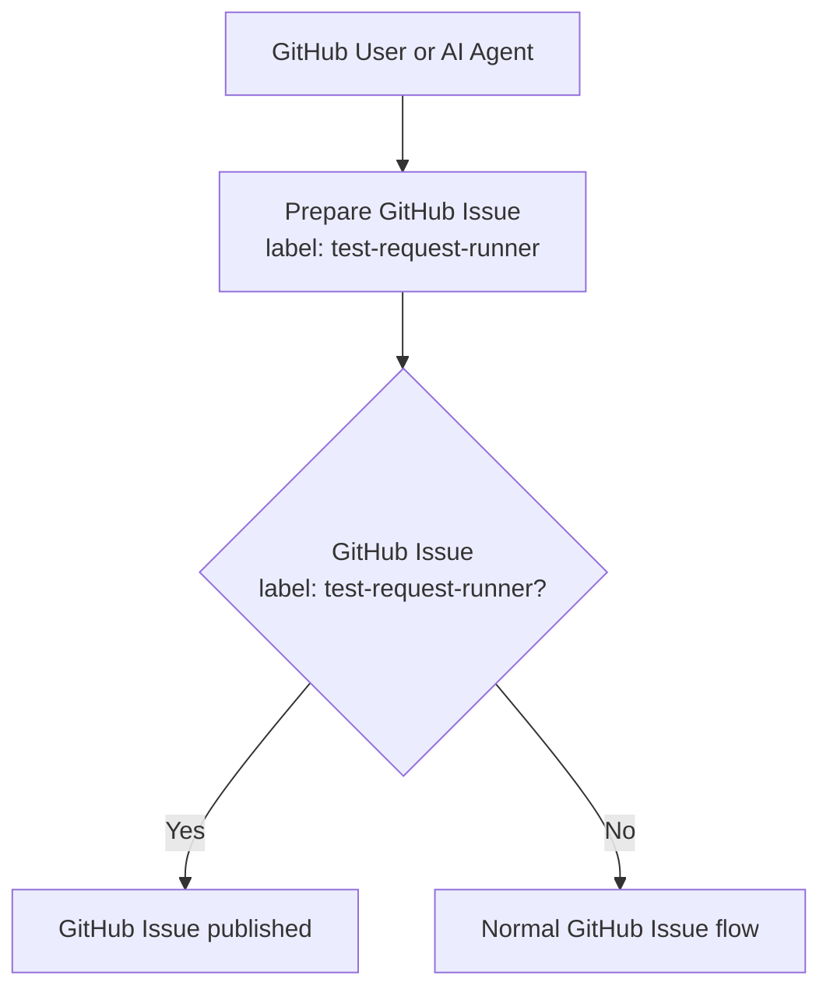
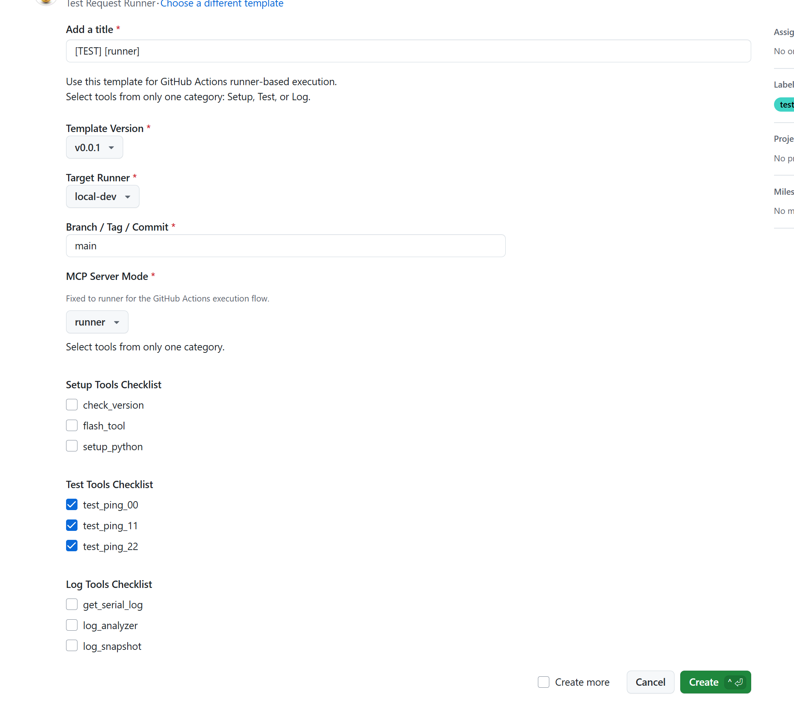
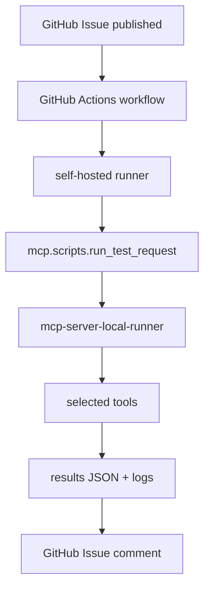
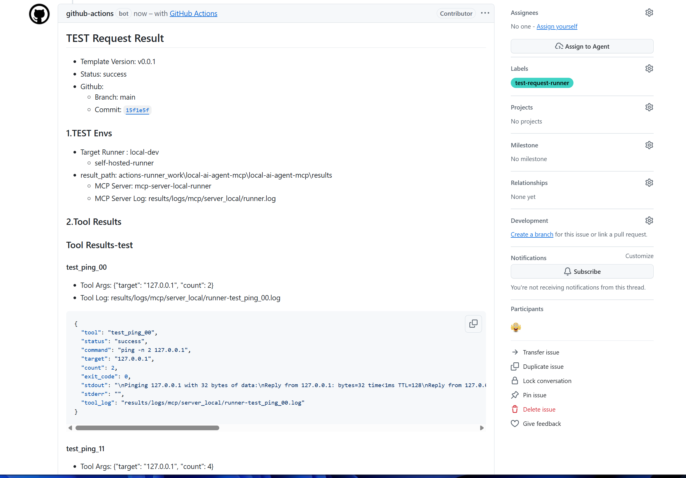

# Automation Design

## Scope

<br/>

* Automation design   
  - CI automation  
  - CD automation   
  - **CT automation based on Github Self-hosted runner**    
    - GitHub Issue based execution paths   
    - direct and runner flow split   

<br/>

---

## CI/CD/CT Automation

<br/>

* Automation Design   
    * Github (Self-hosted runner) based on CI/CD/CT automation
    * Jetson CI/CD pipeline

<br/>

---

### Scope

<br/>

Github Action and Github Self-hosted runner based CI/CD/CT automation

- CI automation (Github Action)
    - Pull Request, Review, and Actions follow-up
- CD automation (Github Action)
    - workflow based delivery path
- **CT automation(Self-hosted runner)**
    - Local MCP tool based test execution
    - JSON, log, and comment trace

<br/>

---

### GitHub Issue Based Entry

<br/>

* Github Issue and Self-hosted runner based CT automation


| Request Type | Label | Template | Execution Path | Main Purpose |
|------|------|------|------|------|
| Runner TEST Request | `test-request-runner` | `test_request_runner.yml` | GitHub Actions -> self-hosted runner | runner based automated test execution |
| Direct TEST Request | `test-request-direct` | `test_request_direct.yml` | Jenkins -> direct MCP execution | direct local test execution |
| General Issue / PR | normal workflow | standard templates | GitHub MCP Server, AI Agent, GitHub Actions | review, update, tracking |


<br/>

---

### Automation Components

<br/>

- **GitHub Actions**
    - runner TEST Request execution
    - **self-hosted runner integration**
    - artifact and comment trace
- Jenkins
    - direct TEST Request execution
    - webhook trigger
    - requested ref checkout
- **Python Bridge**
    - issue body parsing
    - selected tool mapping
    - Local MCP Server call
    - JSON and Markdown result generation

<br/>

---

### Issue Based Flow

<br/>

* Github based on CI/CD/CT   
```text
runner test request issue
  -> GitHub Actions
  -> self-hosted runner
  -> Python bridge
  -> mcp-server-local-runner
```

* Jenkins based on CI/CD/CT 

```text
direct test request issue
  -> Jenkins
  -> Python bridge
  -> mcp-server-local-direct
```
<br/>

* **Github Issue (Request CT)**     
```text
GitHub Issue / PR
  -> GitHub Actions or Jenkins
  -> Python bridge
  -> Local MCP Server
  -> JSON / log / comment
  -> GitHub traceability
```

<br/>

---

## Main Flows

<br/>

MCP and Github Issue based flows are described below.


<br/>

---

### Direct MCP Flow

<br/>

```text
AI Agent or local client
  -> VS Code MCP Gateway
  -> mcp-server-local-direct
  -> local tools
  -> log files + tool result payload
```

<br/>

---


### Runner Test Request Flow


Example:

**Github Issue** publication flow:

- A GitHub User or AI Agent prepares a GitHub Issue
- The `test-request-runner` label selects the runner-based execution path



<br/>

* Github Issue publication example:
Request 3 Tests for ping/ping/ping 


<br/>
<br/>

**Post-publication** execution flow:

- The GitHub Actions workflow is triggered
- The **self-hosted runner** executes `mcp.scripts.run_test_request`
- `mcp-server-local-runner` invokes the selected tools
- Execution outputs are stored as JSON, logs, and a GitHub Issue comment



<br/>

* Github Self-hosted Runner TEST Results Example: 


Go to [This Sample Issue Results](https://github.com/JeonghunLee/local-ai-agent-mcp/issues?q=is%3Aissue%20state%3Aclosed)
Go to [example 1](https://github.com/JeonghunLee/local-ai-agent-mcp/issues/21)

<br/>

Related:

- `.github/workflows/test_request_local.yaml`
- `.github/ISSUE_TEMPLATE/test_request_runner.yml`

<br/>

---

### Direct Test Request Flow

<br/>

```text
GitHub Issue
  -> Jenkins webhook trigger
  -> mcp.scripts.run_test_request
  -> mcp-server-local-direct
  -> selected tools
  -> results JSON + logs
  -> GitHub Issue comment
```

Related:

- `Jenkinsfile`
- `.github/ISSUE_TEMPLATE/test_request_direct.yml`

<br/>

---

## Component Details

### VS Code MCP Gateway

- VS Code internal
- MCP Server connection
- tool discovery
- tool routing

Reference:

- [MCP Gateway](../mcp/mcp_gateway.md)

### Local MCP Server

- local process
- build, flash, test, log tools
- direct mode
- runner mode

Reference:

- [MCP Server-Local](../mcp/mcp_server_local.md)

### GitHub MCP Server

- local process + GitHub API integration
- Issue, Pull Request, Review, Actions access
- no local execution hosting

Reference:

- [MCP Server-GitHub](../mcp/mcp_server_github.md)

### Python Bridge

- repository script layer
- issue body parsing
- tool mapping
- server mode selection
- result JSON generation
- Markdown comment generation

Target scripts:

- `mcp/scripts/run_test_request.py`
- `mcp/scripts/make_test_result.py`

---

## Installation Locations

| Component | Location | Entry |
|------|------|------|
| VS Code MCP Gateway | VS Code internal | VS Code feature |
| Local MCP Server | Local process | Python module |
| GitHub MCP Server | Local process | GitHub API integration |
| GitHub Actions | GitHub runner | workflow |
| Jenkins | Jenkins agent | webhook trigger |
| Local AI | Local host | runtime |
| Remote AI | cloud or local CLI | provider dependent |

---

## Related

- [System Design](system-design.md)
- [MCP Gateway](../mcp/mcp_gateway.md)
- [MCP Server-Local](../mcp/mcp_server_local.md)
- [MCP Server-GitHub](../mcp/mcp_server_github.md)
- [GitHub Templates](../envs/github_templates.md)
