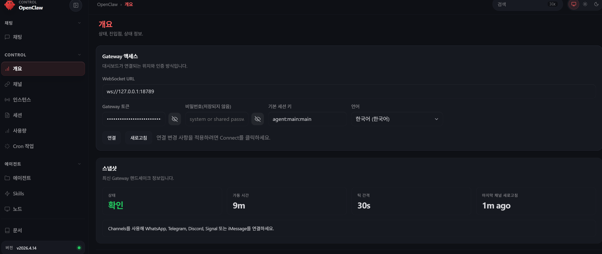
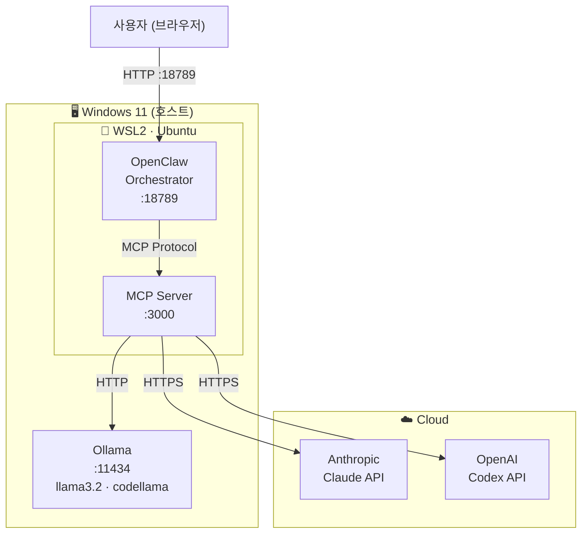

# System Design

* AI Agent 구조 
    * Claude: 구조 설계, 작업 분해, 리팩토링 방향, 코드 생성, 문서화
    * Codex: PR 리뷰, 회귀 위험 지적, 테스트 누락 지적, 수정 patch 초안
    * Ollama: 로그 요약, 테스트 초안, 반복 변환 작업
    * User: 최종 승인

* AI Agent 와 연결 
    * openclaw 

## Deployment Diagram

---

## Component Details

### 1. User Access
브라우저에서 `http://127.0.0.1:18789` 로 OpenClaw Dashboard에 접속합니다.   
Prompt를 입력하면 Orchestrator가 작업 유형에 맞는 Agent를 선택해 라우팅합니다.

### 2. OpenClaw Orchestrator (WSL2)
- **설치 위치**: WSL2 (Ubuntu)   
- **역할**: Prompt를 받아 적합한 Agent 결정 → MCP 서버로 전달   
- **포트**: `:18789` (Dashboard + Gateway)   
- WSL2에 설치하는 이유: 공식 권장 환경, Linux 네이티브 안정성

### 3. MCP Server (WSL2)
- **설치 위치**: WSL2 (Ubuntu), OpenClaw와 동일 환경   
- **역할**: Agent가 호출하는 Tool Server — Git, 빌드, 파일 등 외부 시스템 접근 제공   
- **포트**: `:3000`   

#### Tool Groups

| Tool Group | 포함 도구 | 접근 Agent |
|-----------|----------|-----------|
| Git / GitHub | git cli, GitHub API, PR 생성·조회 | Codex, Claude |
| Build / Test Runner | 빌드 실행, 테스트 실행, 결과 수집 | Codex, Ollama |
| Logs / Files / Reports | 로그 파일 읽기, 리포트 생성, 문서 저장 | Ollama, Claude |

#### Agent별 MCP 접근 범위

| Agent | 접근 Tool |
|-------|----------|
| Claude | Git (코드 읽기), Logs / Files (문서 저장) |
| Codex | Git / GitHub (PR 생성·리뷰), Build / Test Runner (회귀 검증) |
| Ollama | Build / Test Runner (테스트 초안), Logs / Files (로그 분석) |

### 4. Ollama (Windows Native)
- **설치 위치**: Windows 11 호스트   
- **역할**: 로컬 LLM 추론, 인터넷 없이 동작   
- **포트**: `:11434`   
- **모델**: `llama3.2` (범용), `codellama` (코드 특화)   
- Windows에 설치하는 이유: GPU 직접 접근으로 추론 성능 최적화   
- WSL2 → Windows 연결: `localhost:11434` 로 투명하게 접근 가능

### 5. Claude API (Cloud)
- **설치 위치**: 없음 — Anthropic 클라우드에서 실행   
- **연결 방식**: `ANTHROPIC_API_KEY` 환경변수   
- **용도**: 추론, 분석, 장문 컨텍스트 처리

### 6. Codex API (Cloud)
- **설치 위치**: 없음 — OpenAI 클라우드에서 실행   
- **연결 방식**: `OPENAI_API_KEY` 환경변수   
- **용도**: 코드 생성, 리팩토링, 언어 변환

---

## Installation Locations

| 컴포넌트     | 설치 위치            | 포트    |
|-------------|---------------------|---------|
| OpenClaw    | WSL2 (Ubuntu)       | :18789  |
| MCP Server  | WSL2 (Ubuntu)       | :3000   |
| Node.js 24  | WSL2 (Ubuntu)       | —       |
| Ollama      | Windows 11 (호스트) | :11434  |
| Claude API  | 클라우드             | —       |
| Codex API   | 클라우드             | —       |

---

## Agent Workflow

Agent 역할은 고정되어 있으며 아래 순서로 실행된다.

| 순서 | 작업 유형                                              | Agent  | User 검토       |
|-----|-------------------------------------------------------|--------|----------------|
| 1   | 구조 설계 / 작업 분해 / 리팩토링 방향                  | Claude | —              |
| 2   | 코드 생성                                              | Claude | 1차 승인 / 수정 |
| 3   | 문서화                                                 | Claude | 2차 승인 / 수정 |
| 4   | 회귀 위험 지적 / 테스트 누락 지적 / patch 초안         | Codex  | 3차 승인 / 수정 |
| 5   | GitHub PR 요청                                        | GitHub | —              |
| 6   | PR Review                                             | Codex + GitHub Users | 4차 승인 / 수정 |
| 7   | 로그 요약 / 테스트 초안 / 반복 변환 작업               | Ollama | 5차 승인 / 수정 |
| 8   | 결과 테스트 문서화                                     | Codex  | 6차 승인 / 수정 |

---

## Related

- [agents/claude.md](../agents/claude.md) — Claude Agent 설정
- [agents/ollama.md](../agents/ollama.md) — Ollama Agent 설정
- [agents/codex.md](../agents/codex.md) — Codex Agent 설정
- [mcp/mcp_server.md](../mcp/mcp_server.md) — MCP 서버 설정
- [environments/window_wsl2_setup.md](../environments/window_wsl2_setup.md) — WSL2 설치 실험
- [agents/ollama_setup.md](../agents/ollama_setup.md) — Ollama 설치 실험
