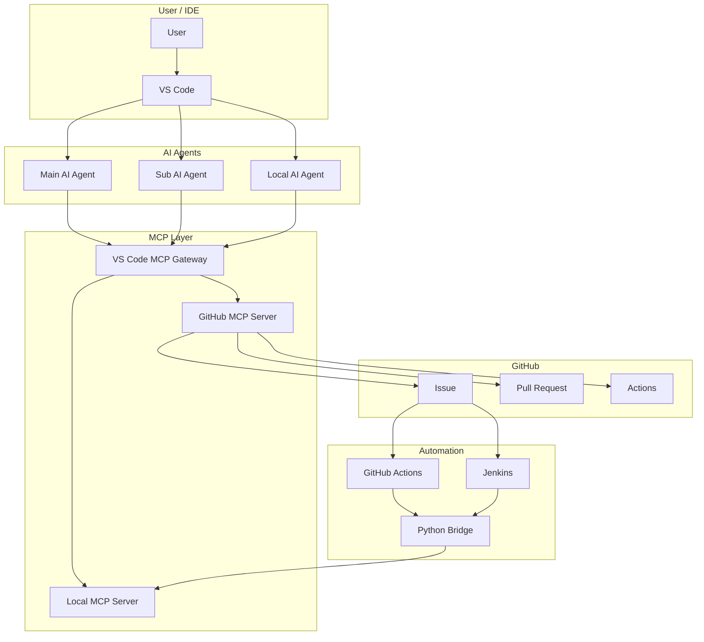

# System Design

## Scope

- AI Agent structure
- MCP connection model
- GitHub integration model
- system level role split

---

## Document Split

This document covers the top-level system structure.

Execution flows and automation details are documented separately:

- [Automation Design](automation-design.md)

---

## AI Agents

| Agent | Main Role |
|------|------|
| Main AI Agent | code generation, document updates, task structure |
| Sub AI Agent | review, test result analysis, Issue and PR follow-up |
| Local AI Agent | optional local helper, repeated execution support, environment side tasks |

Notes:

- role split first
- deployment shape second
- fixed product mapping not required

Examples:

- Main: Claude or Codex
- Sub: Codex or Claude
- Local: Ollama

---

## Remote AI Agents

### Responsibility

- code generation
- document writing
- task split
- review
- test result analysis
- GitHub follow-up

### Deployment

- baseline
  - one Remote AI Agent
- optional extension
  - add Local AI Agent

### Practical Model

- one Remote AI Agent can perform both Main AI and Sub AI roles
- separate Main AI and Sub AI is an operating model, not a hard requirement

---

## Local AI Agents

### Characteristics

- optional component
- local execution support
- partial Sub AI replacement possible

### Examples

- Ollama
- MLX
- vLLM

### Usage

- remote API cost reduction
- repeated local test support
- local log and file based analysis support

---

## System Diagram



---

## AI Agent Working

| Step | Work Type | Owner |
|------|------|------|
| 1 | task structure | Main AI |
| 2 | code and document generation | Main AI |
| 3 | review and risk check | Sub AI |
| 4 | local tool execution | Local MCP Server or Local AI |
| 5 | test result analysis | Sub AI |
| 6 | Issue and PR follow-up | GitHub MCP Server or automation |
| 7 | final decision | User |

Notes:

- execution layer and analysis layer split
- one Remote AI Agent can cover step 1, 2, 3, 5, and 6 together

---

## Agent Interference

- direct overlap minimization
- JSON, log, and comment based handoff
- execution result first
- analysis result second

```text
Local MCP execution
  -> result.json + log
  -> analysis
  -> code or document update
```

---

## Design Principles

- simple execution path first
- clear split between `direct` and `runner`
- GitHub collaboration and local execution separation
- JSON, log, Markdown comment trace
- Local AI stays optional
- role split does not require fixed process split

---

## Related

- [Automation Design](automation-design.md)
- [Claude](../agents/claude.md)
- [Codex](../agents/codex.md)
- [Ollama](../agents/ollama.md)
- [MCP Gateway](../mcp/mcp_gateway.md)
- [MCP Server-Local](../mcp/mcp_server_local.md)
- [MCP Server-GitHub](../mcp/mcp_server_github.md)
- [OpenClaw WSL2 Setup](../envs/openclaw_wsl2_setup.md)
