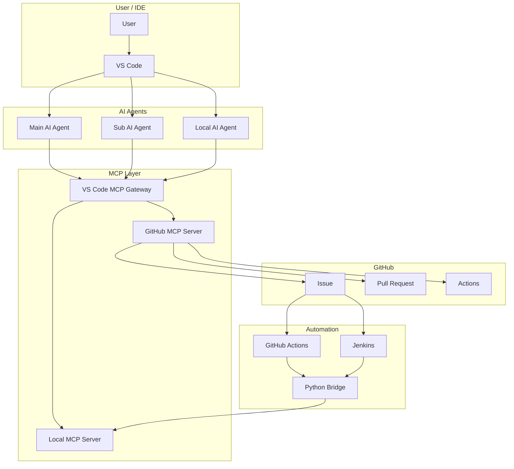

# System Design

## Scope

- AI Agent structure
- MCP connection model
- GitHub integration model
- CI/CD/CT automation path

---

## AI Agents

| Agent | Main Role |
|------|------|
| Main AI Agent | code generation, document updates, task structure |
| Sub AI Agent | review, test result analysis, issue and PR follow-up |
| Local AI Agent | optional local helper, repeated execution support, environment side tasks |

Notes:

- role split first
- deployment shape second
- fixed product mapping not required

Examples:

- Main: Claude or Codex
- Sub: Codex or Claude
- Local: Ollama

---

## Remote AI Agents

### Responsibility

- code generation
- document writing
- task split
- review
- test result analysis
- GitHub follow-up

### Deployment

- baseline
  - one Remote AI Agent
- optional extension
  - add Local AI Agent

### Practical Model

- one Remote AI Agent can perform both Main AI and Sub AI roles
- separate Main AI and Sub AI is an operating model, not a hard requirement

---

## Local AI Agents

### Characteristics

- optional component
- local execution support
- partial Sub AI replacement possible

### Examples

- Ollama
- MLX
- vLLM

### Usage

- remote API cost reduction
- repeated local test support
- local log and file based analysis support

---

## System Diagram



---

## AI Agent Working

| Step | Work Type | Owner |
|------|------|------|
| 1 | task structure | Main AI |
| 2 | code and document generation | Main AI |
| 3 | review and risk check | Sub AI |
| 4 | local tool execution | Local MCP Server or Local AI |
| 5 | test result analysis | Sub AI |
| 6 | Issue and PR follow-up | GitHub MCP Server or automation |
| 7 | final decision | User |

Notes:

- execution layer and analysis layer split
- one Remote AI Agent can cover step 1, 2, 3, 5, and 6 together

---

## Agent Interference

- direct overlap minimization
- JSON, log, and comment based handoff
- execution result first
- analysis result second

```text
Local MCP execution
  -> result.json + log
  -> analysis
  -> code or document update
```

---

## CI/CD/CT Automation

### Scope

- CI automation
  - Pull Request, Review, Actions follow-up
- CD automation
  - workflow based delivery path
- CT automation
  - Local MCP tool based test execution
  - JSON, log, comment trace

### GitHub Issue Based Entry

| Request Type | Label | Template | Execution Path | Main Purpose |
|------|------|------|------|------|
| Runner TEST Request | `test-request-runner` | `test_request_runner.yml` | GitHub Actions -> self-hosted runner | runner based automated test execution |
| Direct TEST Request | `test-request-direct` | `test_request_direct.yml` | Jenkins -> direct MCP execution | direct local test execution |
| General Issue / PR | normal workflow | standard templates | GitHub MCP Server, AI Agent, GitHub Actions | review, update, tracking |

### Automation Components

- GitHub Actions
  - runner TEST Request execution
  - self-hosted runner integration
  - artifact and comment trace
- Jenkins
  - direct TEST Request execution
  - webhook trigger
  - requested ref checkout
- Python Bridge
  - issue body parsing
  - selected tool mapping
  - Local MCP Server call
  - JSON and Markdown result generation

### Issue Based Flow

```text
runner test request issue
  -> GitHub Actions
  -> self-hosted runner
  -> Python bridge
  -> mcp-server-local-runner

direct test request issue
  -> Jenkins
  -> Python bridge
  -> mcp-server-local-direct
```

```text
GitHub Issue / PR
  -> GitHub Actions or Jenkins
  -> Python bridge
  -> Local MCP Server
  -> JSON / log / comment
  -> GitHub traceability
```

---

## Main Flows

### Direct MCP Flow

```text
AI Agent or local client
  -> VS Code MCP Gateway
  -> mcp-server-local-direct
  -> local tools
  -> log files + tool result payload
```

### Runner Test Request Flow

```text
GitHub Issue
  -> GitHub Actions workflow
  -> self-hosted runner
  -> mcp.scripts.run_test_request
  -> mcp-server-local-runner
  -> selected tools
  -> results JSON + logs
  -> GitHub Issue comment
```

Related:

- [.github/workflows/test_request_local.yaml](../../.github/workflows/test_request_local.yaml)
- [.github/ISSUE_TEMPLATE/test_request_runner.yml](../../.github/ISSUE_TEMPLATE/test_request_runner.yml)

### Direct Test Request Flow

```text
GitHub Issue
  -> Jenkins webhook trigger
  -> mcp.scripts.run_test_request
  -> mcp-server-local-direct
  -> selected tools
  -> results JSON + logs
  -> GitHub Issue comment
```

Related:

- [Jenkinsfile](../../Jenkinsfile)
- [.github/ISSUE_TEMPLATE/test_request_direct.yml](../../.github/ISSUE_TEMPLATE/test_request_direct.yml)

---

## Component Details

### VS Code MCP Gateway

- VS Code internal
- MCP Server connection
- tool discovery
- tool routing

Reference:

- [MCP Gateway](../mcp/mcp_gateway.md)

### Local MCP Server

- local process
- build, flash, test, log tools
- direct mode
- runner mode

Reference:

- [MCP Server-Local](../mcp/mcp_server_local.md)

### GitHub MCP Server

- local process + GitHub API integration
- Issue, Pull Request, Review, Actions access
- no local execution hosting

Reference:

- [MCP Server-GitHub](../mcp/mcp_server_github.md)

### Python Bridge

- repository script layer
- issue body parsing
- tool mapping
- server mode selection
- result JSON generation
- Markdown comment generation

Target scripts:

- `mcp/scripts/run_test_request.py`
- `mcp/scripts/make_test_result.py`

---

## Installation Locations

| Component | Location | Entry |
|------|------|------|
| VS Code MCP Gateway | VS Code internal | VS Code feature |
| Local MCP Server | Local process | Python module |
| GitHub MCP Server | Local process | GitHub API integration |
| GitHub Actions | GitHub runner | workflow |
| Jenkins | Jenkins agent | webhook trigger |
| Local AI | Local host | runtime |
| Remote AI | cloud or local CLI | provider dependent |

---

## Design Principles

- simple execution path first
- clear split between `direct` and `runner`
- GitHub collaboration and local execution separation
- JSON, log, Markdown comment trace
- Local AI stays optional
- role split does not require fixed process split

---

## Related

- [Claude](../agents/claude.md)
- [Codex](../agents/codex.md)
- [Ollama](../agents/ollama.md)
- [MCP Gateway](../mcp/mcp_gateway.md)
- [MCP Server-Local](../mcp/mcp_server_local.md)
- [MCP Server-GitHub](../mcp/mcp_server_github.md)
- [OpenClaw WSL2 Setup](../envs/openclaw_wsl2_setup.md)
