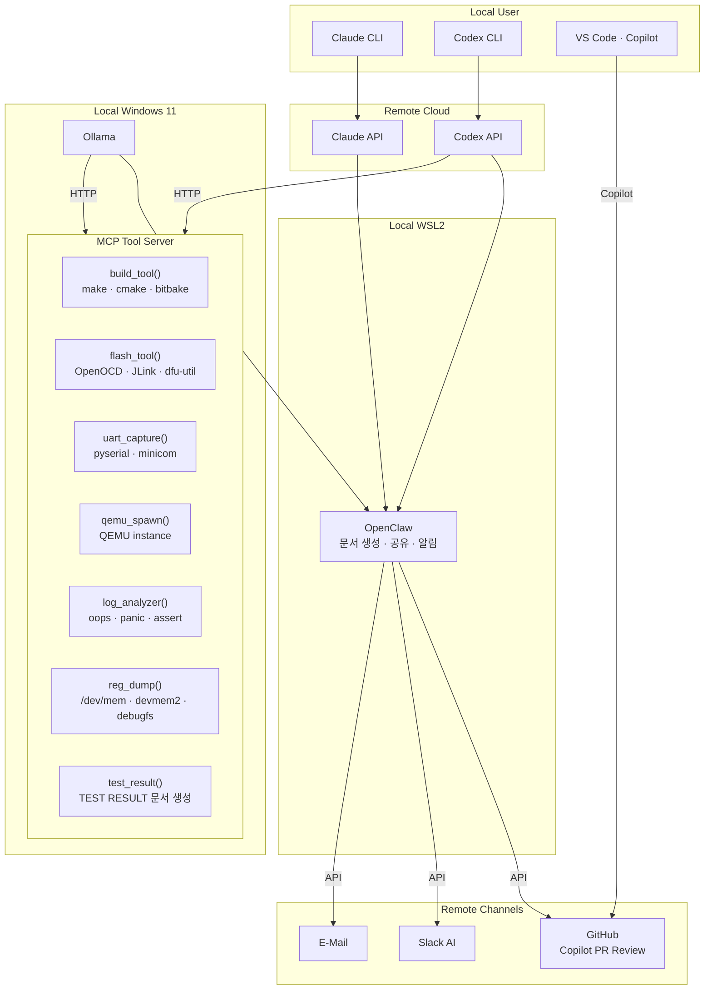
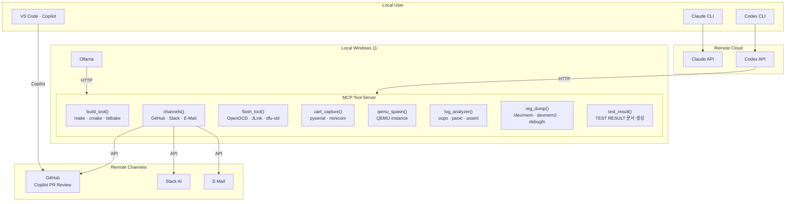

# System Design


* AI Agent 구조 
    * Claude (Main, Remote): 구조 설계, 코드 생성, 문서 생성
    * Codex (Sub, Remote): 코드 리뷰, TEST 분석, TEST 문서 작성
    * Ollama (Local): MCP Tool 실행 — 빌드, UART 캡처, QEMU, 레지스터 덤프
    * User: 최종 승인

* AI Agent 와 Openclaw 연결 
    * openclaw 
    * 각 Channel 연결  
    * E-Mail 자동발송  
    * Github 비롯하여, Slack 과 연결 

## Design Principles

### Loose Coupling — Minimal Agent Interference

- Agent 간 직접 호출 없음 — `result.json`을 매개로 연결
- Ollama: Tool 실행 후 `result.json` 저장, 이후 관여 없음
- Codex: `result.json`을 읽어 감시, 에러 시에만 개입
- 각 Agent는 자신의 역할 범위 밖에 간섭하지 않음

```
Ollama  →  result.json  →  Codex
  (실행)      (매개)        (감시·분석)
```

| 원칙 | 내용 |
|------|------|
| 단방향 데이터 흐름 | Ollama → JSON → Codex, 역방향 없음 |
| 역할 고정 | 실행 Agent가 분석하지 않음, 분석 Agent가 실행하지 않음 |
| 에러 시에만 개입 | 정상 실행 시 Codex는 완료 보고만, 불필요한 호출 없음 |
| Remote Agent 최소화 | Claude · Codex 2개로 제한, 비용·지연 최소화 |


## Deployment Diagram


### Version A — With OpenClaw

OpenClaw이 채널 담당, MCP는 `channels()` 미사용.



### Version B — MCP Only

MCP Server가 Tool 라우팅 + 문서 생성·공유·알림까지 담당하는 단순화된 구조.




---

## Component Details

### 1. User Access
브라우저에서 `http://127.0.0.1:18789` 로 OpenClaw Dashboard에 접속합니다.   
Prompt를 입력하면 Orchestrator가 작업 유형에 맞는 Agent를 선택해 라우팅합니다.

### 2. OpenClaw Orchestrator (WSL2)
- **설치 위치**: WSL2 (Ubuntu)   
- **역할**: Prompt를 받아 적합한 Agent 결정 → MCP 서버로 전달   
- **포트**: `:18789` (Dashboard + Gateway)   
- WSL2에 설치하는 이유: 공식 권장 환경, Linux 네이티브 안정성

### 3. MCP Server (WSL2)
- **설치 위치**: WSL2 (Ubuntu), OpenClaw와 동일 환경   
- **역할**: Agent가 호출하는 Tool Server — 빌드, 플래시, UART, QEMU, 레지스터 덤프 실행   
- **포트**: `:3000`   
- **구현**: Node.js (`mcp-server.js`) 또는 Python (`mcp_server.py`) 선택   
  - Node.js: 빠른 프로토타이핑, JS 생태계  
  - Python: pyserial · subprocess 직접 연동, 임베디드 툴체인에 유리

#### Tool Groups

| Tool Group | 포함 도구 | 담당 | 비고 |
|-----------|----------|------|------|
| 실행 계층 | `build_tool`, `flash_tool`, `uart_capture`, `qemu_spawn`, `reg_dump` | Ollama | 실행만, 분석 없음 |
| 분석 계층 | `log_analyzer`, `test_result` | Codex | 실행 결과 수신 후 문제 파악 · 문서 작성 |
| Git / GitHub | git cli, GitHub API, PR 생성·조회 | Codex | 코드 리뷰 · PR |

#### Agent별 MCP 접근 범위

| Agent | 구분 | Tool | 비고 |
|-------|------|------|------|
| **Ollama** | 실행 | `build_tool`, `flash_tool`, `uart_capture`, `qemu_spawn`, `reg_dump` | 실행만, 분석·판단 없음 |
| Codex | 감시·분석 | `log_analyzer`, `test_result` | Ollama 결과 감시 → 에러 시 분석 후 보고 |
| Claude | 미접근 | — | 코드 생성 · 문서 생성 전담 |

### 4. Ollama (Windows Native)
- **설치 위치**: Windows 11 호스트   
- **역할**: 로컬 LLM 추론, 인터넷 없이 동작   
- **포트**: `:11434`   
- **모델**: `llama3.2` (범용), `codellama` (코드 특화)   
- Windows에 설치하는 이유: GPU 직접 접근으로 추론 성능 최적화   
- WSL2 → Windows 연결: `localhost:11434` 로 투명하게 접근 가능

### 5. Claude API (Cloud)
- **설치 위치**: 없음 — Anthropic 클라우드에서 실행   
- **연결 방식**: `ANTHROPIC_API_KEY` 환경변수   
- **용도**: 추론, 분석, 장문 컨텍스트 처리

### 6. Codex API (Cloud)
- **설치 위치**: 없음 — OpenAI 클라우드에서 실행   
- **연결 방식**: `OPENAI_API_KEY` 환경변수   
- **용도**: 코드 생성, 리팩토링, 언어 변환

---

## Installation Locations

| 컴포넌트     | 설치 위치            | 포트    |
|-------------|---------------------|---------|
| OpenClaw    | WSL2 (Ubuntu)       | :18789  |
| MCP Server  | WSL2 (Ubuntu)       | :3000   |
| Node.js 24  | WSL2 (Ubuntu)       | —       |
| Ollama      | Windows 11 (호스트) | :11434  |
| Claude API  | 클라우드             | —       |
| Codex API   | 클라우드             | —       |

---

## Agent Workflow

Agent 역할은 고정, 아래 순서로 실행.

### AI Agent Harness Version A

OpenClaw가 문서 생성·공유·알림을 담당하는 구조.

| 순서 | 작업 유형 | Agent | Orchestrator | User 검토 |
|-----|-----------|-------|-------------|----------|
| 1 | 구조 설계 / 작업 분해 | Claude (Main) | OpenClaw | — |
| 2 | 코드 생성 | Claude (Main) | OpenClaw | 1차 승인 / 수정 |
| 3 | 문서 생성 | Claude (Main) | OpenClaw | 2차 승인 / 수정 |
| 4 | 코드 리뷰 / 회귀 위험 지적 / patch 초안 | Codex (Sub) | OpenClaw | 3차 승인 / 수정 |
| 5 | GitHub PR 요청 | GitHub | OpenClaw | — |
| 6 | PR Review | Codex (Sub) + GitHub Users | OpenClaw | 4차 승인 / 수정 |
| 7 | TEST 분석 | Codex (Sub) | OpenClaw | 5차 승인 / 수정 |
| 8 | TEST 문서 작성 | Codex (Sub) | OpenClaw | 6차 승인 / 수정 |

> Ollama: 각 단계에서 MCP Tool(`build_tool`, `uart_capture`, `qemu_spawn`, `reg_dump`) 실행 담당

### AI Agent Harness Version B

MCP Server 내부에 Channel 추가, Orchestrator 제거 후 단순화된 구조.

| 순서 | 작업 유형 | Agent | Orchestrator | User 검토 |
|-----|-----------|-------|-------------|----------|
| 1 | 구조 설계 / 작업 분해 | Claude (Main) | CLI | — |
| 2 | 코드 생성 | Claude (Main) | CLI | 1차 승인 / 수정 |
| 3 | 문서 생성 | Claude (Main) | CLI | 2차 승인 / 수정 |
| 4 | 코드 리뷰 / 회귀 위험 지적 / patch 초안 | Codex (Sub) | CLI | 3차 승인 / 수정 |
| 5 | GitHub PR 요청 | GitHub | MCP | — |
| 6 | PR Review | Codex (Sub) + GitHub Users | MCP | 4차 승인 / 수정 |
| 7 | TEST 분석 | Codex (Sub) | MCP | 5차 승인 / 수정 |
| 8 | TEST 문서 작성 | Codex (Sub) | MCP | 6차 승인 / 수정 |

> Ollama: 각 단계에서 MCP Tool(`build_tool`, `uart_capture`, `qemu_spawn`, `reg_dump`) 실행 담당

---

## Related

- [agents/claude.md](../agents/claude.md) — Claude Agent 설정
- [agents/ollama.md](../agents/ollama.md) — Ollama Agent 설정
- [agents/codex.md](../agents/codex.md) — Codex Agent 설정
- [mcp/mcp_server.md](../mcp/mcp_server.md) — MCP 서버 설정
- [environments/window_wsl2_setup.md](../environments/window_wsl2_setup.md) — WSL2 설치 실험
- [agents/ollama_setup.md](../agents/ollama_setup.md) — Ollama 설치 실험
