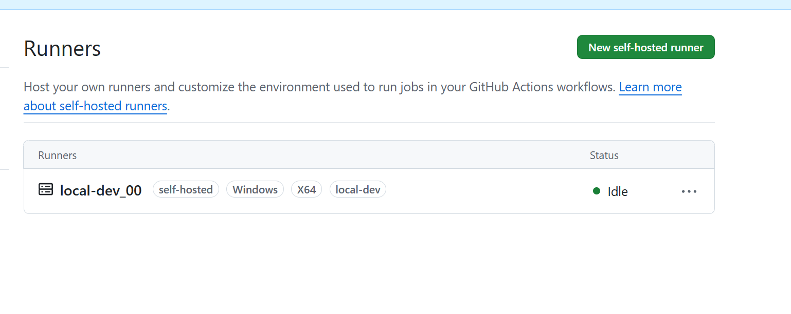
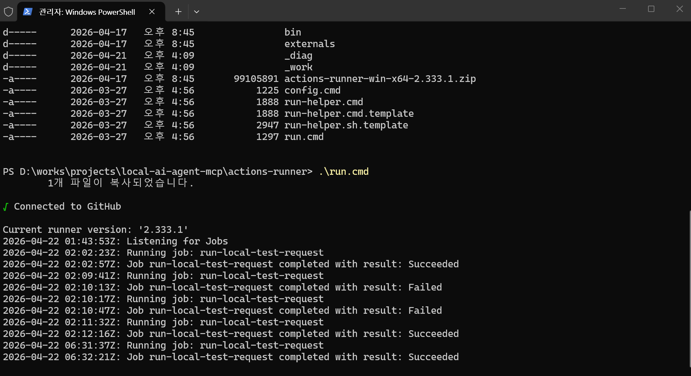

# Self-hosted Runner

## References

- GitHub-hosted runners  
  https://docs.github.com/en/actions/reference/runners/github-hosted-runners
- Self-hosted runners  
  https://docs.github.com/en/actions/reference/runners/self-hosted-runners

---

## Overview

This document explains the relationship between `Target Runner` and a GitHub `self-hosted runner`.

Key points:

- `Target Runner` is the logical execution owner for a TEST request
- the execution owner can be a GitHub Actions `self-hosted runner`, a remote worker, a lab node, or a dedicated test machine
- in this repository, `Target Runner` is used as a broader routing name
- when possible, align `Target Runner` with the GitHub runner label

Interpretation:

- document view
  - `Target Runner` = execution node responsible for the TEST request
- GitHub Actions view
  - `self-hosted runner` = execution node that receives the job from GitHub

---

## Quick Start

1. Open `Settings > Actions > Runners` in the GitHub repository.
2. Select `New self-hosted runner`.
3. Choose the runner image and architecture.
4. Run `config.cmd` and complete registration.
5. Use `runs-on` with `self-hosted` and the project label.

Recommended mapping for this repository:

- `Target Runner`: `local-dev`
- runner label: `local-dev`



```text
Connected to GitHub

Current runner version: '2.333.1'
2026-04-20 05:30:21Z: Listening for Jobs
```

---

## Recommended Naming

The simplest rule is to use the same value for the GitHub runner label and the TEST request `Target Runner`.

Example:

- local machine role: `local-dev`
- GitHub runner label: `local-dev`
- TEST request `Target Runner`: `local-dev`

Benefits:

- easier Issue routing
- easier Actions routing
- less naming ambiguity

---

## Connect My PC

### 1. Prepare Runner Directory

This document assumes the runner workspace is placed inside the repository root.

```powershell
cd D:\works\projects\local-ai-agent-mcp
mkdir action-runner
cd .\action-runner
```

Reasons:

- easier local path management
- repository path and runner path stay aligned
- simpler explanation for logs and scripts

Notes:

- `action-runner` is usually not tracked by Git
- add it to `.gitignore` if needed

### 2. Get Registration Commands from GitHub

Repository path:

- `Settings`
- `Actions`
- `Runners`
- `New self-hosted runner`

Runner release reference:

- https://github.com/actions/runner/releases

### 3. Set Runner Name and Labels

During `config.cmd`, GitHub asks for:

- runner group
- runner name
- labels
- service installation choice

| Target Runner | Meaning |
|------|------|
| `local-dev_00` | developer-managed local execution environment |
| `qemu-runner` | emulator-based test environment |
| `lab-node-01` | hardware lab node |
| `windows-hw-01` | Windows hardware test node |

Administrator privileges are recommended.

```powershell
--------------------------------------------------------------------------------
|        ____ _ _   _   _       _          _        _   _                      |
|       / ___(_) |_| | | |_   _| |__      / \   ___| |_(_) ___  _ __  ___      |
|      | |  _| | __| |_| | | | | '_ \    / _ \ / __| __| |/ _ \| '_ \/ __|     |
|      | |_| | | |_|  _  | |_| | |_) |  / ___ \ (__| |_| | (_) | | | \__ \     |
|       \____|_|\__|_| |_|\__,_|_.__/  /_/   \_\___|\__|_|\___/|_| |_|___/     |
|                                                                              |
|                       Self-hosted runner registration                        |
|                                                                              |
--------------------------------------------------------------------------------

# Authentication

Connected to GitHub

# Runner Registration

Enter the name of the runner group to add this runner to: [press Enter for Default]
Enter the name of runner: [press Enter for JHLEE] local-dev_00
This runner will have the following labels: 'self-hosted', 'Windows', 'X64'
Enter any additional labels (ex. label-1,label-2): [press Enter to skip] local-dev

Runner successfully added

# Runner settings

Enter name of work folder: [press Enter for _work]

Settings Saved.

Would you like to run the runner as service? (Y/N) [press Enter for N]
```

Example:

```text
runner name: my-pc
labels: self-hosted, Windows, X64, local-dev
```

The important part is adding a project-specific label such as `local-dev`.

### 4. Choose How to Run It

For a quick check, run it directly from the `action-runner` directory:

```powershell
.\run.cmd
```



To keep it available after reboot, install it as a service:

```powershell
.\svc install
.\svc start
```

Running as a service keeps the runner available after logout.

### 5. Verify Runner Status in GitHub

After registration, the runner should appear as `Idle` or `Online` in `Settings > Actions > Runners`.

If not, check:

- firewall or proxy restrictions
- expired registration token
- whether `run.cmd` or the service is actually running
- whether the label matches the expected value

---

## Workflow Mapping

Registering a runner is not enough. A workflow must explicitly target that runner.

Example:

```yaml
jobs:
  test-on-local-dev:
    runs-on: [self-hosted, local-dev]
    steps:
      - uses: actions/checkout@v4
      - name: Show runner
        run: echo "running on self-hosted local-dev"
```

`runs-on: [self-hosted, local-dev]` means GitHub selects only a runner that has both labels.

---

## Current Repository Status

Current repository workflows:

- `.github/workflows/github_pages.yaml`
- `.github/workflows/test_request_local.yaml`

Current TEST automation path:

- `test_request_local.yaml` uses a self-hosted runner
- current label expectation is `local-dev`

---

## Issue-Based Flow

```text
GitHub Issue
  -> resolve Target Runner
  -> selected Runner or Worker processes the request
  -> Local MCP tool execution
  -> logs + result.json
  -> GitHub Issue comment
```

In this model, `Target Runner` is not just metadata. It is an execution ownership and routing key.

---

## Mapping Strategy

Recommended mapping:

- Issue `Target Runner`: `local-dev`
- GitHub Actions self-hosted runner label: `local-dev`

This keeps human routing and workflow routing aligned.

---

## Multiple Runners

`Target Runner` can be a single value or a comma-separated candidate list.

Recommended rules:

- use a single runner by default
- use a comma-separated list only when needed
- interpret multiple values as `OR`

Example:

```text
Target Runner: qemu-runner, lab-node-01
```

Meaning:

- either `qemu-runner` or `lab-node-01` may process the request
- the first claimer handles it

---

## Ownership Rules

When multiple runners exist, the minimum coordination rules are:

1. Each TEST request must declare `Target Runner`.
2. Each runner should pick only executable requests.
3. Claim the request with an assignee or label when work starts.
4. Record completion with labels such as `test-done` or `test-failed`.

Suggested labels:

- `test-request`
- `test-running`
- `test-done`
- `test-failed`

---

## Relationship with MCP

A self-hosted runner is not the same thing as an MCP Server.

Roles:

- Runner or Worker
  - execution environment for the TEST request
- Local MCP Server
  - tool interface exposed in the execution environment
- GitHub MCP Server
  - interface for Issue, comment, and status operations on GitHub

Practical flow:

```text
GitHub Issue
  -> Runner or Worker
  -> request inspection through GitHub integration
  -> Local MCP Server tool execution
  -> result generation
  -> result reporting back to GitHub
```

---

## Recommended Position

In this repository, the safest interpretation is:

- now
  - `Target Runner` is a logical execution node name
- later
  - it can map 1:1 to a GitHub Actions self-hosted runner label

For a local machine, a stable label such as `local-dev` is the simplest operating model.

---

## Related

- [GitHub Templates](github_templates.md)
- [MCP Server-Local](../mcp/mcp_server_local.md)
- [MCP Server-GitHub](../mcp/mcp_server_github.md)
