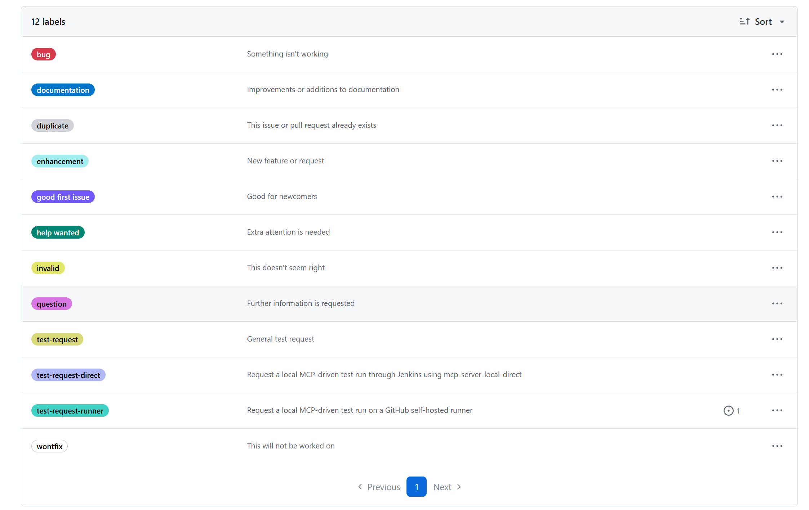
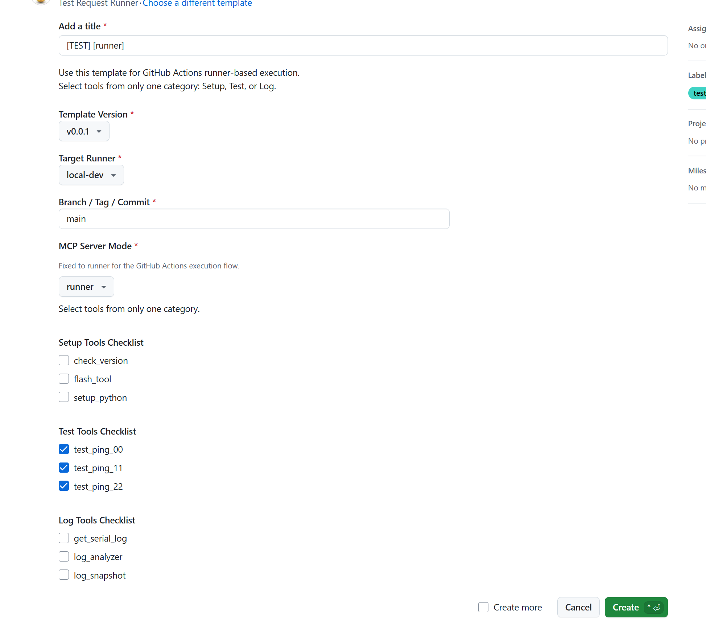
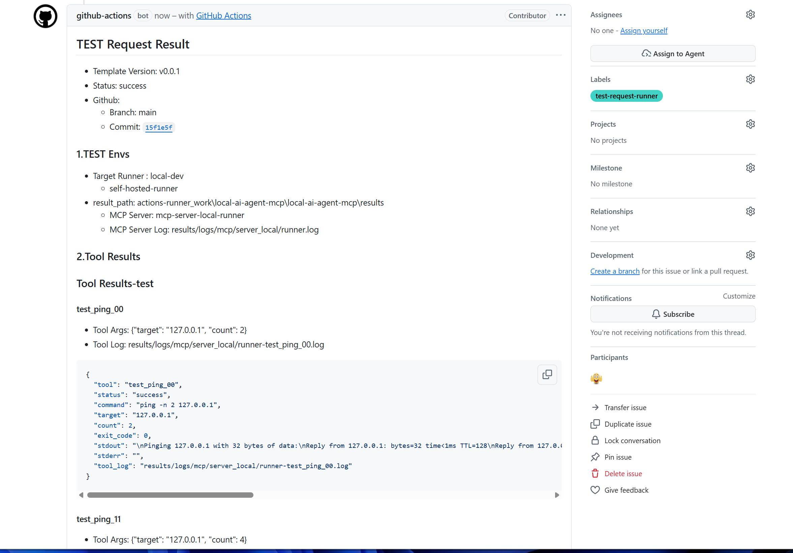

# GitHub Templates

## Overview

- GitHub Issue templates
- Pull Request template
- GitHub Actions automation entry
- TEST request structure

Key point:

- this document is not only about templates
- the main purpose is GitHub Action Automation based on Issue input

---

## Automation First

### Main Automation Paths

| Path | Trigger | Main Engine | Purpose |
|------|------|------|------|
| Runner TEST Request | GitHub Issue with `test-request-runner` | GitHub Actions | self-hosted runner based TEST automation |
| Direct TEST Request | GitHub Issue with `test-request-direct` | Jenkins or AI Agent | direct MCP execution request |
| Docs Site Publish | repository event | GitHub Actions | GitHub Pages publish |
| Tag Release Publish | Git tag `v*` | GitHub Actions | GitHub Release creation and asset upload |

### Workflow Files

| Workflow | File | Role |
|------|------|------|
| Test Request Local Runner | `.github/workflows/test_request_local.yaml` | Issue based TEST automation on self-hosted runner |
| GitHub Pages | `.github/workflows/github_pages.yaml` | documentation build, Pages publish, and tag-based release step |

Notes:

- workflow count: `2`
- the TEST request flow is the operationally important GitHub Actions automation path
- the Pages workflow is the documentation delivery path
- tag-based release publishing is handled in `github_pages.yaml`

---

## Template List

| Template | File | Purpose |
|------|------|------|
| Bug Report | `.github/ISSUE_TEMPLATE/bug_report.md` | reproducible bug report |
| Documentation | `.github/ISSUE_TEMPLATE/documentation.md` | documentation update request |
| Feature Request | `.github/ISSUE_TEMPLATE/feature_request.md` | feature addition or improvement request |
| Question | `.github/ISSUE_TEMPLATE/question.md` | question or clarification |
| Test Request Direct | `.github/ISSUE_TEMPLATE/test_request_direct.yml` | direct MCP execution request |
| Test Request Runner | `.github/ISSUE_TEMPLATE/test_request_runner.yml` | GitHub Actions runner based TEST request |
| Pull Request | `.github/pull_request_template.md` | change summary and review context |

---

## TEST Request Templates

### Purpose

- TEST execution request
- ref based execution request
- result trace through JSON, log, and Issue comment

### Files

- [.github/ISSUE_TEMPLATE/test_request_direct.yml](../../.github/ISSUE_TEMPLATE/test_request_direct.yml)
- [.github/ISSUE_TEMPLATE/test_request_runner.yml](../../.github/ISSUE_TEMPLATE/test_request_runner.yml)

### Shared Fields

- `Template Version`
- `Target Runner`
- `Branch / Tag / Commit`
- `MCP Server Mode`
- setup tool checklist
- test tool checklist
- log tool checklist

### Current Split

| Request Type | Label | Execution Path | Notes |
|------|------|------|------|
| Runner | `test-request-runner` | GitHub Actions -> self-hosted runner -> `mcp-server-local-runner` | GitHub Actions automation path |
| Direct | `test-request-direct` | Jenkins or AI Agent -> `mcp-server-local-direct` | direct execution path |



### Examples

```md
## Request Ref
- Template Version: v0.0.1
- Branch / Tag / Commit: main
- Target Runner: local-dev
- MCP Server Mode: runner

## Test Tool
- [x] test_ping_00
- [ ] test_ping_11
- [ ] test_ping_22
```

Runner example notes:

- label: `test-request-runner`
- title: `[TEST] [runner]`
- category selection: `Test` only

```md
## Request Ref
- Template Version: v0.0.1
- Branch / Tag / Commit: main
- Target Runner: ai-agent
- MCP Server Mode: direct

## Log Tool
- [x] get_serial_log
- [x] log_analyzer
- [ ] log_snapshot
```

Direct example notes:

- label: `test-request-direct`
- title: `[TEST] [direct]`
- category selection: `Log` only





---

## Runner Automation

### Flow

```text
GitHub Issue
  -> label: test-request-runner
  -> GitHub Actions
  -> self-hosted runner
  -> mcp.scripts.run_test_request
  -> mcp-server-local-runner
  -> results JSON + logs
  -> issue comment
```

### Related Files

- [.github/workflows/test_request_local.yaml](../../.github/workflows/test_request_local.yaml)
- [.github/ISSUE_TEMPLATE/test_request_runner.yml](../../.github/ISSUE_TEMPLATE/test_request_runner.yml)

### Characteristics

- GitHub Actions driven
- self-hosted runner required
- artifact upload included
- result comment generation included

---

## Direct Execution

### Flow

```text
GitHub Issue
  -> label: test-request-direct
  -> Jenkins or AI Agent
  -> mcp.scripts.run_test_request
  -> mcp-server-local-direct
  -> results JSON + logs
  -> issue comment
```

### Related Files

- [.github/ISSUE_TEMPLATE/test_request_direct.yml](../../.github/ISSUE_TEMPLATE/test_request_direct.yml)
- [Jenkinsfile](../../Jenkinsfile)

### Characteristics

- direct MCP mode
- execution owner selected by `Target Runner`
- GitHub Actions workflow is not the main engine in this path

---

## Title Rule

```text
[TEST] [runner]
[TEST] [direct]
```

Examples:

```text
[TEST] [runner]
[TEST] [direct]
```

Current mapping:

- title prefix `"[TEST] [runner] "` -> label `test-request-runner`
- title prefix `"[TEST] [direct] "` -> label `test-request-direct`

Notes:

- the current templates do not use date-based titles
- the current split is driven by two Issue labels
- `Target Runner` is part of the Issue body, not the title

---

## Target Runner

### Runner Template Examples

- `local-dev`

### Direct Template Examples

- `jenkins`
- `ai-agent`

Notes:

- runner template target values are tied to self-hosted runner selection
- direct template target values are execution owner values

Reference:

- [GitHub Self Hosted Runner](github_self_hosted_runner.md)

---

## Usage Guidance

### Use Bug Report When

- a defect needs reproduction and tracking

### Use Feature Request When

- a change proposal or feature idea is needed

### Use TEST Request When

- a specific ref needs execution
- logs and JSON output are needed
- execution trace must remain on GitHub

Key point:

- TEST Request is an execution request
- Pull Request is a code change request

---

## Pull Request Template

File:

- [.github/pull_request_template.md](../../.github/pull_request_template.md)

Typical contents:

- change summary
- key updates
- test result summary
- related document updates

---

## Release Publishing

File:

- [.github/workflows/github_pages.yaml](../../.github/workflows/github_pages.yaml)

Purpose:

- tag-based GitHub Release creation
- release asset upload
- release body generation inside the workflow

Trigger:

- Git tag matching `v*`

Notes:

- release publishing is workflow-based
- there is no separate release template file
- the current workflow includes a release upload step using `softprops/action-gh-release`

---

## Recommended Labels

- `test-request-runner`
- `test-request-direct`
- `test-running`
- `test-done`
- `test-failed`

---

## Directory Structure

```text
.github/
  ISSUE_TEMPLATE/
    bug_report.md
    documentation.md
    feature_request.md
    question.md
    test_request_direct.yml
    test_request_runner.yml
  pull_request_template.md
  workflows/
    github_pages.yaml
    test_request_local.yaml
```

---

## Related

- [GitHub Self Hosted Runner](github_self_hosted_runner.md)
- [MCP Server-Local](../mcp/mcp_server_local.md)
- [MCP Server-GitHub](../mcp/mcp_server_github.md)
- [MCP Gateway](../mcp/mcp_gateway.md)
- [System Design](../architecture/system-design.md)
