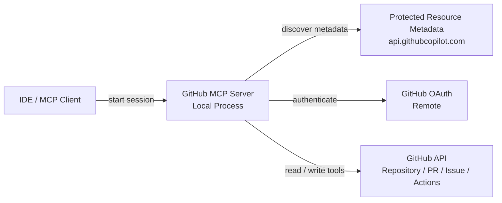

# GitHub MCP Server

## Overview

GitHub `Repository`, `Pull Request`, `Issue`, `Review`, `Actions` 대상 MCP(Model Context Protocol) `Tool` 제공용 전용 서버.

확인 기준 로그:

```text
2026-04-17 10:33:22.770 [info] Starting server io.github.github/github-mcp-server
2026-04-17 10:33:22.770 [info] Connection state: Starting
2026-04-17 10:33:22.770 [info] Starting server from LocalProcess extension host
2026-04-17 10:33:22.771 [info] Connection state: Running
2026-04-17 10:33:25.037 [info] Discovered resource metadata at https://api.githubcopilot.com/.well-known/oauth-protected-resource/mcp/
2026-04-17 10:33:25.037 [info] Using auth server metadata url: https://github.com/login/oauth
2026-04-17 10:33:25.440 [info] Discovered authorization server metadata at https://github.com/.well-known/oauth-authorization-server/login/oauth
2026-04-17 10:33:33.737 [info] Discovered 44 tools
```

핵심 판단:

- 범용 MCP Server보다 GitHub 전용 MCP Server 성격
- Local 실행 + Remote GitHub 인증/데이터 구조
- `44 tools` 발견 상태

---

## 1. Log Summary

| Log | Meaning |
|------|------|
| `Starting server io.github.github/github-mcp-server` | GitHub MCP Server 시작 |
| `Starting server from LocalProcess extension host` | Local process 기반 실행 |
| `Connection state: Running` | MCP 세션 정상 상태 |
| `Discovered resource metadata at https://api.githubcopilot.com/.../mcp/` | 보호 리소스 메타데이터 탐색 |
| `Using auth server metadata url: https://github.com/login/oauth` | GitHub OAuth 사용 |
| `Discovered authorization server metadata ...` | OAuth 메타데이터 확인 |
| `Discovered 44 tools` | MCP `Tool` 44개 노출 |

### Key Points

- Server process: Local
- Authentication: Remote GitHub OAuth
- Data source: Remote GitHub API
- Runtime shape: `Local Process + Remote GitHub API/OAuth`
- `44 tools`: 시작 시점 discovery 결과

---

## 2. GitHub MCP Server Capabilities

주요 기능군:

- `Repository` 조회 / 검색
- `Pull Request` 조회 / diff / review
- `Issue` 생성 / 수정 / label / assignee
- `Commit` / `Branch` / `File` 조회 및 갱신
- `GitHub Actions` run / job / step / log
- `Review Thread` / `Reaction` / reply / resolve

### Capability Diagram



### 2.1 GitHub MCP Server Location (Local / Remote)

| Component | Location | Description |
|------|------|------|
| MCP Server Process | Local | IDE 또는 MCP Client 프로세스 |
| OAuth Server | Remote | `github.com/login/oauth` |
| Protected Resource Metadata | Remote | `api.githubcopilot.com` |
| Data Source | Remote | GitHub `Repository` / `PR` / `Issue` / `Actions` |

### Structure Summary

- Execution: Local
- Auth: Remote
- Data: Remote
- Scope 결정 요소: GitHub API + server implementation

---

## 3. 44 Tools and Their Roles

주의:

- 로그 기준 확인 사실: `Discovered 44 tools`
- 로그 미포함 항목: 개별 `Tool` 이름 전체
- 아래 표: 일반적인 GitHub MCP Server 패턴 기준 역할군 정리
- 실제 목록 확인 수단: MCP Inspector, `tools/list`

| Role Group | Example Tasks |
|--------|-----------|
| `Repository Metadata` | 저장소 정보, default branch |
| `Repository Search` | 접근 가능한 저장소 검색 |
| `Branch Search` | branch 검색, 기준 branch 선택 |
| `File Fetch` | 특정 ref 파일 조회 |
| `Blob Fetch` | blob SHA 기반 조회 |
| `Commit Fetch` | 단일 commit 메타데이터, 변경 내용 |
| `Commit Compare` | 두 ref 간 변경 파일, 통계 비교 |
| `Commit Search` | commit 검색 |
| `Commit Status` | combined status, check 결과 |
| `Workflow Run Lookup` | 특정 commit의 Actions run |
| `Workflow Jobs` | run 내 job 목록 |
| `Workflow Steps` | job step 상태 |
| `Workflow Logs` | 실패 job log |
| `PR Metadata` | PR 제목, 상태, base/head branch |
| `PR Diff` | PR diff, patch |
| `PR Patch By File` | 파일 단위 PR patch |
| `PR File List` | 변경 파일 목록 |
| `PR Discussion` | PR comment, review comment, review event |
| `PR Reviews` | review 목록 |
| `PR Review Threads` | inline review thread, resolve 상태 |
| `PR Reactions` | reaction 조회, 추가 |
| `PR Comment Reply` | inline review comment reply |
| `PR Review Submit` | approve, request changes, review 제출 |
| `PR Reviewer Request` | reviewer, team reviewer 요청 |
| `PR Ready/Draft` | Draft, Ready for Review 전환 |
| `PR Update` | 제목, 본문, 상태, base branch 수정 |
| `PR Merge` | merge, squash, rebase |
| `PR Auto Merge` | auto-merge |
| `Issue Fetch` | Issue 본문, 상태, 메타데이터 |
| `Issue Comments` | Issue comment |
| `Issue Create` | Issue 생성 |
| `Issue Update` | 제목, 본문, 상태, milestone 수정 |
| `Issue Labels` | label 추가, 제거 |
| `Issue Assignees` | assignee 추가, 제거 |
| `Issue Lock` | conversation lock, unlock |
| `Issue Comment Update` | top-level comment 수정 |
| `Issue Reactions` | Issue comment reaction |
| `File Create` | 파일 생성 |
| `File Update` | 파일 수정 |
| `File Delete` | 파일 삭제 |
| `Blob Create` | blob 생성 |
| `Tree Create` | Git tree 생성 |
| `Commit Create` | Git commit 생성 |
| `Ref Update` | branch ref 이동, branch 생성 |

### Practical Grouping

| Group | Included Capabilities |
|------|-----------|
| Read | `Repository`, `File`, `Commit`, `PR`, `Issue` 조회 |
| Search | `Repository`, `Branch`, code, `PR`, `Issue`, `Commit` 검색 |
| Collaboration | `Review`, comment, reaction, label, assignee |
| CI / Verification | `Actions` run, job, step, log |
| Write | 파일 생성/수정/삭제, branch, commit, merge |

---

## 4. Custom Tool Extensibility

### Conclusion

확장 가능.

구분 기준:

- GitHub MCP Server 내부 확장
- 별도 Custom MCP Server 추가
- Wrapper / Orchestrator 계층 추가

| Approach | Possible | Description |
|------|-----------|------|
| Modify GitHub MCP Server itself | Yes | 서버 소스 수정 기반 `Tool` 추가 |
| Add tools by config only | Limited | 설정만으로 임의 `Tool` 추가는 제한적 |
| Add a separate Custom MCP Server | Best option | GitHub 전용 서버 유지 + 프로젝트 전용 서버 추가 |
| Build a Wrapper Server | Yes | 여러 GitHub `Tool` 호출을 상위 `Tool`로 추상화 |

### A. Extend the GitHub MCP Server Itself

예시:

- `create_release_summary()`
- `bulk_label_pull_requests()`
- `sync_project_board_item()`

장점:

- GitHub 기능과 직접 통합
- 단일 MCP Server 관점

주의:

- 공식 서버 직접 수정 난이도
- 업스트림 업데이트 시 유지보수 비용

### B. Add a Separate Custom MCP Server

예시:

- `ct_report_publish()`
- `jira_sync()`
- `firmware_test_summary()`
- `local_policy_check()`

장점:

- GitHub MCP Server 비수정
- 프로젝트별 기능 자유도
- 운영 측면 현실성

주의:

- MCP Client 추가 등록 필요
- 역할 경계 문서화 필요

### C. Add a Wrapper / Orchestrator Tool

예시:

- `prepare_release_pr()`
- `review_failed_ci_and_comment()`

조합 예:

1. PR 조회
2. 변경 파일 목록 확인
3. Actions 실패 log 수집
4. comment 작성
5. label 추가

장점:

- 사용자 직접 조합 부담 감소
- workflow 표준화 용이

---

## Recommendation

권장 구성:

- GitHub 데이터 조회/수정: GitHub MCP Server
- 빌드, 테스트, log 분석, 문서 생성: 프로젝트 전용 MCP Server
- 다단계 자동화: Wrapper `Tool` 또는 상위 Orchestrator

---

## Notes

- `44 tools` 수: 서버 버전, 인증 범위, MCP Client 구현 영향
- 실제 개별 목록 필요 시: MCP Inspector 또는 `tools/list` 결과 캡처
- 현재 문서 기준: 확보 로그 + 일반적인 GitHub MCP Server 패턴
