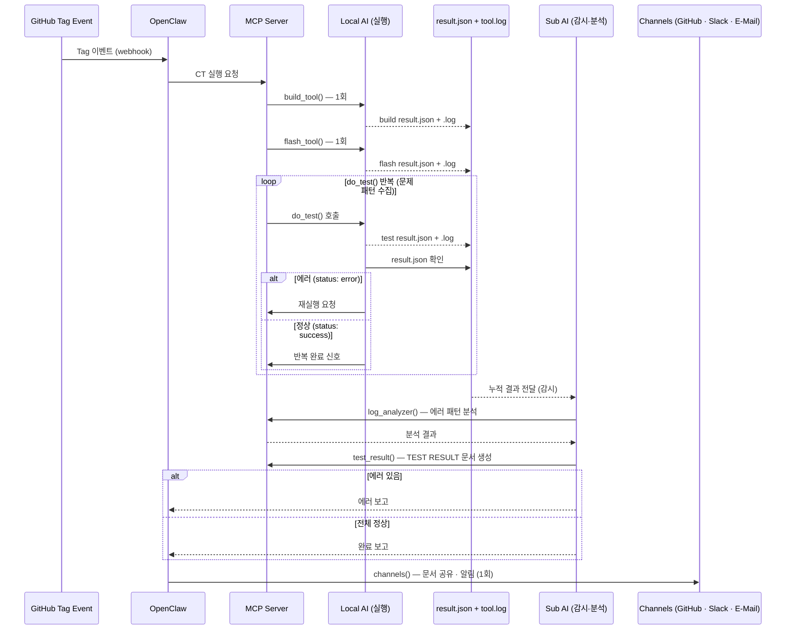
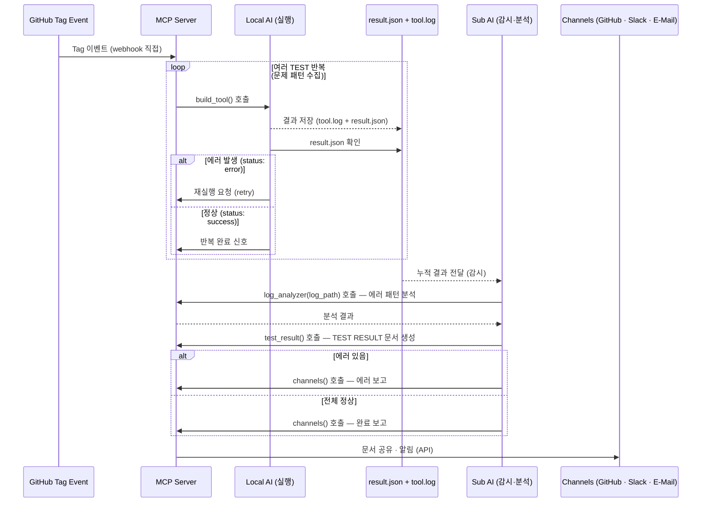

# MCP Server

## Overview

MCP Server는 **CT(Continuous Testing)** 전용 서버.   
Tag 이벤트를 명령 트리거로 받아 테스트 실행 → 문제 파악 → 분석 → 문서 작성 → 보고까지 자동 처리한다.

```
Tag Event → MCP Server → Local AI (실행) → result.json + .log
                                             → Remote Sub AI (감시·분석) → TEST RESULT 문서 → 보고
```

| 이름 | AI Agent 역할 | 동작역할 |
|------ |------ |------| 
| **Main AI**  |  Remote Main    | MCP 미접근 — 코드 생성·문서 생성 전담 |
| **Sub AI**   |  Remote Sub   |  감시·분석 전담 — 실행 결과 감시, 에러 시 `log_analyzer` 호출, TEST 문서 작성 후 보고 |
| **Local AI** |  Remote Sub AI or Local AI        | 실행 + 반복 전담 — Tool 실행 → result.json 확인 → 에러 시 재실행, 여러 TEST 반복으로 문제 패턴 수집 |

**Remote Agent 구성**

| 구성 | Remote Agent 수 | Sub 역할 처리 |
|------|----------------|--------------|
| 2-Agent | Main + Sub | Sub가 독립 처리 |
| 1-Agent | Main only | Main이 Sub 역할 대행 (`log_analyzer`, `test_result` 권한 부여) |

**Local Agent 구성**

| 구분 | Version A | Version B |
|------|-----------|-----------|
| 트리거 수신 | Tag Event → OpenClaw → MCP | Tag Event → MCP 직접 |
| Channel 담당 | OpenClaw | MCP `channels()` |
| MCP 역할 | CT Tool Server | CT Tool Server + Channel Router |

---

## Version A — With OpenClaw

OpenClaw이 채널(GitHub · Slack · E-Mail)을 담당하며, MCP는 `channels()` 미포함.

### Registered Tools

| Tool | 설명 | 담당 | 실행 |
|------|------|------|------|
| `build_tool()` | make · cmake · bitbake 빌드 실행 | Local AI | 1회 |
| `flash_tool()` | OpenOCD · JLink · dfu-util 플래시 | Local AI | 1회 |
| `do_test_<type>_<nn>()` | 타입별 테스트 실행 — 각자 log 생성 방식 보유 | Local AI | 반복 |
| &nbsp;&nbsp;`→ uart_capture()` | pyserial · minicom UART 로그 캡처 | do_test 내부 | — |
| &nbsp;&nbsp;`→ qemu_spawn()` | QEMU 인스턴스 실행 후 콘솔 로그 수집 | do_test 내부 | — |
| &nbsp;&nbsp;`→ reg_dump()` | /dev/mem · devmem2 · debugfs 레지스터 덤프 | do_test 내부 | — |
| &nbsp;&nbsp;`→ file_read()` | 지정 경로 파일 로그 수집 | do_test 내부 | — |
| `log_analyzer()` | oops · panic · assert 분석 — 누적 결과 에러 패턴 파악 | Sub AI | 반복 완료 후 1회 |
| `test_result()` | TEST RESULT 문서 생성 | Sub AI | 1회 |
| `channels()` | GitHub · Slack · E-Mail 채널 라우팅 | MCP 내부 | 1회 |

### Protocol Flow



### Server Configuration (`mcp-config.json`)

```json
{
  "server": {
    "name": "openclaw-mcp",
    "version": "1.0.0",
    "port": 3000
  },
  "version": "A",
  "remote_agents": {
    "main": { "provider": "claude", "enabled": true },
    "sub":  { "provider": "codex",  "enabled": true }
  },
  "channels": { "enabled": false },
  "tools": {
    "build_tool": { "enabled": true },
    "flash_tool": { "enabled": true },
    "uart_capture": { "enabled": true },
    "qemu_spawn": { "enabled": true },
    "log_analyzer": { "enabled": true },
    "reg_dump": { "enabled": true }
  },
  "logging": {
    "output_dir": "../logs",
    "format": "markdown"
  }
}
```

---

## Version B — MCP Only

OpenClaw 없이 MCP가 Tool 라우팅 + 채널 연동까지 담당하는 단순화된 구조.

### Registered Tools

| Tool | 설명 | 담당 | 실행 |
|------|------|------|------|
| `build_tool()` | make · cmake · bitbake 빌드 실행 | Local AI | 1회 |
| `flash_tool()` | OpenOCD · JLink · dfu-util 플래시 | Local AI | 1회 |
| `do_test_<type>_<nn>()` | 타입별 테스트 실행 — 각자 log 생성 방식 보유 | Local AI | 반복 |
| &nbsp;&nbsp;`→ uart_capture()` | pyserial · minicom UART 로그 캡처 | do_test 내부 | — |
| &nbsp;&nbsp;`→ qemu_spawn()` | QEMU 인스턴스 실행 후 콘솔 로그 수집 | do_test 내부 | — |
| &nbsp;&nbsp;`→ reg_dump()` | /dev/mem · devmem2 · debugfs 레지스터 덤프 | do_test 내부 | — |
| &nbsp;&nbsp;`→ file_read()` | 지정 경로 파일 로그 수집 | do_test 내부 | — |
| `log_analyzer()` | oops · panic · assert 분석 — 누적 결과 에러 패턴 파악 | Sub AI | 반복 완료 후 1회 |
| `test_result()` | TEST RESULT 문서 생성 | Sub AI | 1회 |
| `channels()` | GitHub · Slack · E-Mail 채널 라우팅 | MCP 내부 | 1회 |

### Protocol Flow



### Server Configuration (`mcp-config.json`)

```json
{
  "server": {
    "name": "openclaw-mcp",
    "version": "1.0.0",
    "port": 3000
  },
  "version": "B",
  "remote_agents": {
    "main": { "provider": "claude", "enabled": true },
    "sub":  { "provider": "codex",  "enabled": true }
  },
  "channels": {
    "enabled": true,
    "github": { "enabled": true },
    "slack": { "enabled": true },
    "email": { "enabled": true }
  },
  "tools": {
    "build_tool": { "enabled": true },
    "flash_tool": { "enabled": true },
    "uart_capture": { "enabled": true },
    "qemu_spawn": { "enabled": true },
    "log_analyzer": { "enabled": true },
    "reg_dump": { "enabled": true }
  },
  "logging": {
    "output_dir": "../logs",
    "format": "markdown"
  }
}
```

---

## Agent Communication — Log + JSON

모든 Tool 실행은 **Log 파일**과 **JSON 파일** 두 가지를 남긴다.   
- **Log**: 원시 출력 전체 — 에러 분석용  
- **JSON**: 구조화된 결과 요약 — Sub AI 감시 판단용

### Output File Rules

| Tool | Log 파일 | JSON 파일 |
|------|----------|----------|
| `build_tool()` | `logs/build_<timestamp>.log` | `results/build_<timestamp>.json` |
| `flash_tool()` | `logs/flash_<timestamp>.log` | `results/flash_<timestamp>.json` |
| `uart_capture()` | `logs/uart_<timestamp>.log` | `results/uart_<timestamp>.json` |
| `qemu_spawn()` | `logs/qemu_<timestamp>.log` | `results/qemu_<timestamp>.json` |
| `reg_dump()` | `logs/reg_<timestamp>.log` | `results/reg_<timestamp>.json` |

### result.json Schema

```json
{
  "tool": "build_tool",
  "timestamp": "2026-04-16T10:00:00Z",
  "status": "success | error",
  "exit_code": 0,
  "log_path": "logs/build_20260416T100000.log",
  "duration_ms": 3200,
  "context": {
    "command": "make",
    "target": "all",
    "working_dir": "/workspace"
  }
}
```

| 필드 | 설명 |
|------|------|
| `tool` | 실행한 Tool 이름 |
| `timestamp` | 실행 시각 (ISO 8601) |
| `status` | `success` / `error` — Sub AI 감시 판단 기준 |
| `exit_code` | 프로세스 종료 코드 (0 = 정상) |
| `log_path` | 상세 로그 파일 경로 — 에러 시 `log_analyzer()` 입력으로 사용 |
| `duration_ms` | 실행 소요 시간 (ms) |
| `context` | Tool 실행 파라미터 |

### Sub AI Monitoring Logic

```
result.json 수신
  └─ status == "error"  →  log_analyzer(log_path) 호출 → 분석 결과 보고
  └─ status == "success" →  완료 보고
```

---

## Tool Definition Example

### Naming Convention

```
do_test_<type>_<nn>()

  type : 테스트 방식 — uart / qemu / reg / file
  nn   : 테스트 번호 — 01, 02, 03 ...

예시)
  do_test_uart_01()   — UART 로그 기반 부팅 테스트 1번
  do_test_uart_02()   — UART 로그 기반 네트워크 테스트 2번
  do_test_qemu_01()   — QEMU 콘솔 로그 기반 커널 테스트 1번
  do_test_reg_01()    — 레지스터 덤프 기반 드라이버 테스트 1번
  do_test_file_01()   — 파일 로그 기반 스토리지 테스트 1번
```

### Log Generation Methods (Sub-functions)

각 `do_test_<type>_<nn>()`은 `log_method`에 따라 아래 sub-function 중 하나 이상을 내부 호출한다.

| Sub-function | 로그 방식 | 사용 예 |
|-------------|----------|--------|
| `uart_capture()` | 시리얼 포트 UART 출력 수집 | 실제 장치 부팅 · 런타임 로그 |
| `qemu_spawn()` | QEMU 콘솔 출력 수집 | 하드웨어 없이 커널 · 드라이버 테스트 |
| `reg_dump()` | 메모리 맵 레지스터 덤프 | 드라이버 상태 · 하드웨어 오류 진단 |
| `file_read()` | 지정 경로 로그 파일 수집 | syslog · dmesg · 애플리케이션 로그 |

### do_test Schema

```json
{
  "name": "do_test_<type>_<nn>",
  "description": "타입별 반복 테스트 실행 — 지정된 log_method로 로그 수집 후 result.json + .log 저장",
  "inputSchema": {
    "type": "object",
    "properties": {
      "target":     { "type": "string", "description": "테스트 대상 장치 또는 이미지" },
      "iterations": { "type": "integer", "description": "최대 반복 횟수", "default": 3 },
      "log_method": {
        "type": "array",
        "items": { "type": "string", "enum": ["uart_capture", "qemu_spawn", "reg_dump", "file_read"] },
        "description": "사용할 log 수집 sub-function 목록 (순서대로 실행)"
      }
    },
    "required": ["target", "log_method"]
  }
}
```

**예시 — UART 기반 테스트**

```json
{
  "name": "do_test_uart_01",
  "target": "/dev/ttyUSB0",
  "iterations": 3,
  "log_method": ["uart_capture", "reg_dump"]
}
```

**예시 — QEMU 기반 테스트**

```json
{
  "name": "do_test_qemu_01",
  "target": "zephyr.elf",
  "iterations": 5,
  "log_method": ["qemu_spawn", "file_read"]
}
```

```json
{
  "name": "build_tool",
  "description": "빌드 시스템 실행 후 결과 반환 (make · cmake · bitbake)",
  "inputSchema": {
    "type": "object",
    "properties": {
      "command": { "type": "string", "description": "make · cmake · bitbake" },
      "target": { "type": "string", "description": "빌드 타겟" },
      "working_dir": { "type": "string", "description": "빌드 디렉터리" }
    },
    "required": ["command"]
  }
}
```

```json
{
  "name": "test_result",
  "description": "테스트 실행 결과를 수집하고 TEST RESULT 문서(Markdown)로 저장",
  "inputSchema": {
    "type": "object",
    "properties": {
      "test_suite": { "type": "string", "description": "테스트 스위트 이름" },
      "results": {
        "type": "array",
        "items": {
          "type": "object",
          "properties": {
            "name": { "type": "string" },
            "status": { "type": "string", "enum": ["pass", "fail", "skip"] },
            "message": { "type": "string" }
          }
        }
      },
      "output_path": { "type": "string", "description": "저장 경로 (예: docs/logs/test_result_00.md)" }
    },
    "required": ["test_suite", "results", "output_path"]
  }
}
```

```json
{
  "name": "channels",
  "description": "GitHub · Slack · E-Mail 채널로 메시지 또는 문서 전송 (Version B 전용)",
  "inputSchema": {
    "type": "object",
    "properties": {
      "target": { "type": "string", "enum": ["github", "slack", "email"] },
      "payload": { "type": "object", "description": "전송할 데이터" }
    },
    "required": ["target", "payload"]
  }
}
```

---

## Agent Tool Access

| Agent | 구분 | Tool | 비고 |
|-------|------|------|------|
| **Local AI** | 실행·반복 | `build_tool` (1회), `flash_tool` (1회), `do_test` (반복) | 빌드·플래시 후 do_test 반복 실행, result.json 확인하며 문제 패턴 수집 |
| Sub AI | 감시·분석 | `log_analyzer` (1회), `test_result` (1회) | 누적 결과 수신 → 에러 패턴 깊은 분석 → TEST 문서 작성 → 보고 |
| Claude | 미접근 | — | 코드 생성 · 문서 생성 전담 |

---

## Setup

두 가지 구현 중 하나를 선택한다.

| 구분 | 언어 | 파일 | 적합한 경우 |
|------|------|------|------------|
| Node.js | TypeScript / JavaScript | `mcp-server.js` | 빠른 프로토타이핑, JS 생태계 활용 |
| Python | Python 3.11+ | `mcp_server.py` | 임베디드 툴체인 연동, pyserial · subprocess 활용 |

### Node.js

```bash
# WSL2
npm install @modelcontextprotocol/sdk

node mcp-server.js
```

`mcp-config.json` — Node.js 서버 설정

```json
{
  "server": { "name": "openclaw-mcp", "version": "1.0.0", "port": 3000 },
  "runtime": "node",
  "tools": {
    "build_tool": { "enabled": true },
    "flash_tool": { "enabled": true },
    "uart_capture": { "enabled": true },
    "qemu_spawn": { "enabled": true },
    "reg_dump": { "enabled": true },
    "log_analyzer": { "enabled": true },
    "test_result": { "enabled": true }
  },
  "output": {
    "log_dir": "logs",
    "result_dir": "results"
  }
}
```

### Python

```bash
# WSL2
pip install mcp

python mcp_server.py
```

`mcp-config.json` — Python 서버 설정

```json
{
  "server": { "name": "openclaw-mcp", "version": "1.0.0", "port": 3000 },
  "runtime": "python",
  "tools": {
    "build_tool": { "enabled": true },
    "flash_tool": { "enabled": true },
    "uart_capture": { "enabled": true, "backend": "pyserial" },
    "qemu_spawn": { "enabled": true },
    "reg_dump": { "enabled": true },
    "log_analyzer": { "enabled": true },
    "test_result": { "enabled": true }
  },
  "output": {
    "log_dir": "logs",
    "result_dir": "results"
  }
}
```

> Python 구성은 `uart_capture()`에 `pyserial`을 직접 사용할 수 있어 시리얼 장치 연동에 유리.

**1-Agent 구성 예시** — Main 1개가 Sub 역할 대행

```json
{
  "remote_agents": {
    "main": { "provider": "claude", "enabled": true },
    "sub":  { "enabled": false }
  }
}
```

> `sub.enabled: false` 시 MCP가 `log_analyzer`, `test_result` 호출 권한을 Main으로 위임.

- 기본 포트: `localhost:3000` (Node.js · Python 공통)
- Version 전환: `mcp-config.json`의 `version` 필드와 `channels.enabled` 조정

---

## Related

- [architecture/system-design.md](../architecture/system-design.md) — Deployment Diagram (Version A / B)
- [agents/claude.md](../agents/claude.md) — Claude Agent 설정
- [agents/codex.md](../agents/codex.md) — Codex Agent 설정
- [agents/ollama.md](../agents/ollama.md) — Ollama Agent 설정
