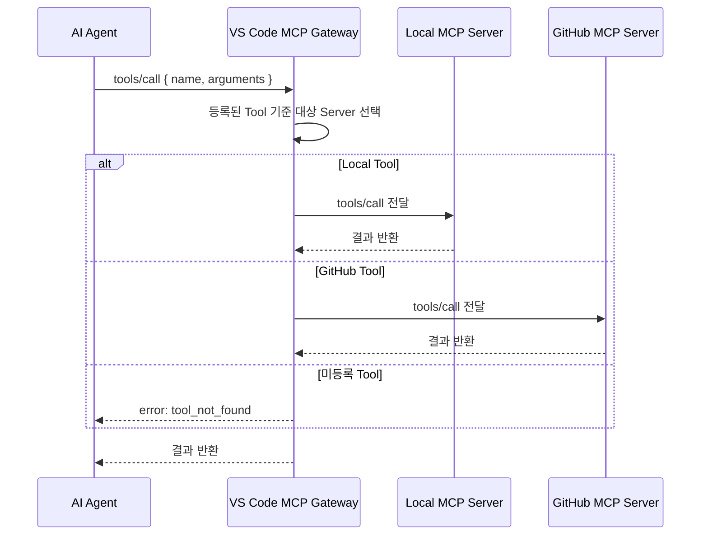
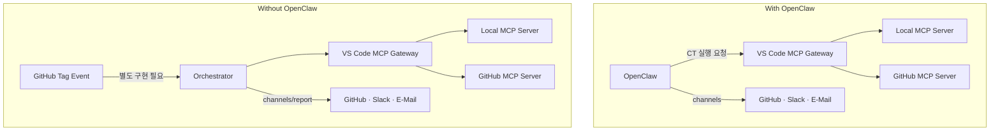

# MCP Gateway

* MCP Gateway
  VS Code가 여러 MCP Server를 동시에 연결하고 선택적으로 호출하는 내부 허브 기능

## Overview

이 문서에서 말하는 MCP Gateway는 별도 프로세스로 구현한 커스텀 게이트웨이 서버가 아니라,  
**VS Code 내부 MCP Gateway 기능**을 기준으로 설명한다.

즉 현재 의도는 다음과 같다.

- VS Code가 `.vscode/mcp.json`에 등록된 여러 MCP Server에 동시에 연결
- AI Agent가 필요할 때 각 Server의 Tool을 직접 호출
- Local Tool은 `mcp-server-local-direct` 또는 `mcp-server-local-runner`, GitHub Tool은 `github-mcp-server`를 사용

중요한 점:

- VS Code MCP Gateway는 **연결과 Tool 라우팅**을 담당한다
- 하지만 **Tag Event 수신, result.json 감시, Sub AI 분석 자동 연결**까지 대신해주지는 않는다
- 그런 end-to-end 실행 흐름은 별도의 오케스트레이션 로직이 필요하다

```
AI Agent
  └─ Tool 호출
       └─ VS Code MCP Gateway
            ├─ Local MCP Server          — 빌드 · 테스트 · 로그 Tool
            └─ GitHub MCP Server         — Repository · PR · Issue Tool
```

---

## VS Code MCP System 

* MCP configuration reference       
  https://code.visualstudio.com/docs/copilot/reference/mcp-configuration

* Add and manage MCP servers in VS Code      
  https://code.visualstudio.com/docs/copilot/chat/mcp-servers

* **MCP developer guide**      
  https://code.visualstudio.com/api/extension-guides/mcp


## Role

| 구성 요소 | 위치 | 역할 |
|----------|------|------|
| **VS Code MCP Gateway** | VS Code 내부 | MCP Server 연결 · Tool discovery · Tool 호출 라우팅 |
| [MCP Server-Local](mcp_server_local.md) | Local | `build_tool`, `flash_tool`, `do_test`, `log_analyzer` 등 CT Tool |
| [MCP Server-GitHub](mcp_server_github.md) | Local Process + Remote GitHub API | `PR`, `Issue`, `Repository`, `Actions` Tool |

---

## Current Usage

현재 이 프로젝트에서 실제로 사용하는 방식은 아래와 같다.

1. VS Code가 `.vscode/mcp.json`을 읽고 MCP Server들을 시작한다.
2. `mcp-server-local-direct`와 `github-mcp-server`가 각각 연결된다.
3. AI Agent는 Tool 이름과 목적에 따라 적절한 Server의 Tool을 호출한다.
4. 각 Tool의 실행 순서와 업무 흐름은 VS Code Gateway가 자동으로 오케스트레이션하지 않는다.

즉 VS Code Gateway는 `Hub`에 가깝고, 별도 `Workflow Engine`은 아니다.

현재 TEST Request 자동 실행은 VS Code Gateway가 담당하지 않는다.

현재 구현된 자동 경로:

```text
GitHub Issue
  → GitHub Actions
  → Python bridge (mcp.local_action_runner.run_test_request)
  → Local MCP Server
```

즉 `GitHub Issue -> GitHub Actions -> Python bridge -> Local MCP Server` 경로와,
VS Code MCP Gateway를 통한 일반 Tool 호출 경로는 서로 다른 층위의 흐름이다.

---

## Routing Rules

Tool 이름 prefix 기준으로 대상 서버를 결정한다.

| Tool prefix / 이름 | 대상 서버 |
|--------------------|-----------|
| `build_*`, `flash_*`, `do_test_*` | Local MCP Server |
| `uart_capture`, `qemu_spawn`, `reg_dump`, `file_read` | Local MCP Server |
| `log_analyzer`, `test_result` | Local MCP Server |
| `channels` | Local MCP Server (Version B) |
| `github_*`, `pr_*`, `issue_*`, `repo_*`, `commit_*`, `workflow_*` | GitHub MCP Server |
| 미등록 Tool | 오류 반환 (`tool_not_found`) |

---

## Protocol Flow



---

## Gateway Variants

### Version A

**with OpenClaw**

OpenClaw 쪽 Gateway를 별도로 둘 수는 있지만, 이 프로젝트의 현재 문서 기준 기본 전제는 아니다.

Window WSL 
```
cat ~/.openclaw/openclaw.json
```

```json
...
  "gateway": {
    "mode": "local",
    "auth": {
      "mode": "token",
      "token": "xxxxxxxx"
    },
    "port": 18789,
    "bind": "loopback",
    "tailscale": {
      "mode": "off",
      "resetOnExit": false
    },
    "controlUi": {
      "allowInsecureAuth": true
    },
    "nodes": {
      "denyCommands": [
        "camera.snap",
        "camera.clip",
        "screen.record",
        "contacts.add",
        "calendar.add",
        "reminders.add",
        "sms.send",
        "sms.search"
      ]
    }
  },
...
```

### Version B

* VS Code Internal MCP Gateway Log
```
2026-04-17 10:30:15.965 [info] [McpGatewayService] Initialized
```

* VS Code Internal MCP Gateway
  - VS Code 내부 서비스
  - `.vscode/mcp.json` 또는 User `mcp.json` 관리 대상
  - 여러 MCP Server를 동시에 붙이는 허브
  - OpenClaw Gateway 설정 파일과 별도
  - 현재 프로젝트에서 우선 사용하는 방향

* Workspace MCP Config Example
```json
{
  "servers": {
    "mcp-server-local-direct": {
      "command": "python",
      "args": [
        "-m",
        "mcp.server_local_direct.server"
      ],
      "cwd": "${workspaceFolder}"
    }
  }
}

```

---

## With / Without OpenClaw

| 구성 | 트리거 수신 | Gateway 역할 |
|------|-----------|-------------|
| **With OpenClaw** | OpenClaw → 별도 흐름 제어 | OpenClaw이 채널 담당, VS Code Gateway는 MCP Tool 연결만 담당 |
| **Without OpenClaw** | 수동 Tool 호출 또는 별도 트리거 구현 필요 | VS Code Gateway는 연결 허브이며 자동 실행 흐름은 별도 구현 필요 |



---

## Limitation

VS Code MCP Gateway만으로는 아래 항목이 자동으로 완성되지 않는다.

- GitHub Tag Event webhook 수신
- Local MCP 실행 결과의 반복 감시
- `result.json` 기반 재시도
- Sub AI의 `log_analyzer` / `test_result` 자동 연결
- 최종 보고 자동 게시

즉 이 문서의 Gateway는 `연결 허브`이고, CT 파이프라인 전체를 실행하는 `오케스트레이터`는 아니다.

---

## Agent Tool Access

| Agent | Tool 호출 대상 | Gateway 경유 |
|-------|--------------|-------------|
| **Local AI** | `build_tool`, `flash_tool`, `do_test_*` | Gateway → Local MCP Server |
| **Sub AI** | `log_analyzer`, `test_result` | Gateway → Local MCP Server |
| **Sub AI** | `pr_*`, `issue_*`, `workflow_*` | Gateway → GitHub MCP Server |
| **Main AI** | Tool 미접근 — 코드·문서 생성 전담 | — |

---

## Related

- [mcp_server_local.md](mcp_server_local.md) — CT Tool 상세 정의, Protocol Flow
- [mcp_server_github.md](mcp_server_github.md) — GitHub MCP Server 44 Tools
- [architecture/system-design.md](../architecture/system-design.md) — 시스템 구조 및 Deployment Diagram
