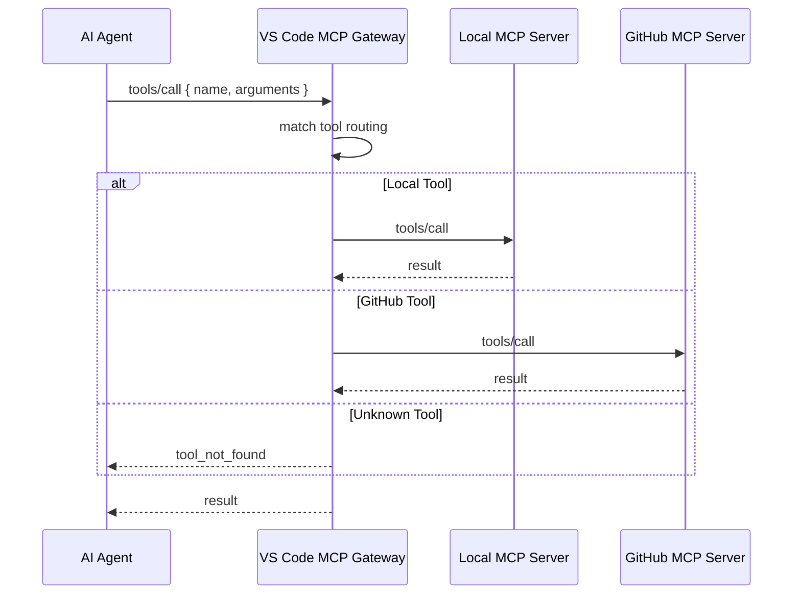

# MCP Gateway

## Overview

- VS Code internal MCP Gateway
- multiple MCP Server connections
- tool routing and tool discovery
- Local MCP Server + GitHub MCP Server bridge

---

## MCP Purpose

- AI Agent to Local Tool connection
- AI Agent to GitHub resource connection
- common tool call path
- execution layer and collaboration layer split

### AI Agent Connection Purpose

- shell command dependency reduction
- common interface for build, flash, test, log tools
- unified access to Issue, Pull Request, Review, Actions
- agent role based tool selection

---

## Deployment Note

- Reference model
  - Main AI, Sub AI, Local AI role split
- Practical model
  - one Remote AI Agent can cover Main AI + Sub AI together
  - Local AI is optional
- Interpretation
  - role split is a documentation model
  - runtime deployment can use 1, 2, or 3 agents

---

## Role

| Component | Location | Role |
|------|------|------|
| VS Code MCP Gateway | VS Code internal | MCP Server connection, tool discovery, tool routing |
| [MCP Server-Local](mcp_server_local.md) | Local | `build_tool`, `flash_tool`, `do_test_*`, `log_analyzer`, `test_result` |
| [MCP Server-GitHub](mcp_server_github.md) | Local Process + Remote GitHub API | `pr_*`, `issue_*`, `repo_*`, `workflow_*` |

---

## Current Usage

1. VS Code reads `.vscode/mcp.json`.
2. VS Code connects MCP servers.
3. AI Agent selects tools by task.
4. Gateway routes the call to the matched MCP Server.

Notes:

- VS Code MCP Gateway is a connection hub.
- It is not a full workflow engine.
- end-to-end CT orchestration still needs workflow logic outside the gateway.

---

## Routing Rules

| Tool Prefix | Target Server |
|------|------|
| `build_*`, `flash_*`, `do_test_*` | Local MCP Server |
| `uart_capture`, `qemu_spawn`, `reg_dump`, `file_read` | Local MCP Server |
| `log_analyzer`, `test_result` | Local MCP Server |
| `github_*`, `pr_*`, `issue_*`, `repo_*`, `commit_*`, `workflow_*` | GitHub MCP Server |

---

## Protocol Flow



---

## Gateway Scope

- covered
  - MCP Server connection
  - tool discovery
  - tool call routing
- not covered
  - GitHub event webhook receive
  - result polling
  - automatic result analysis chaining
  - automatic final report posting

---

## Agent Tool Access

| Agent | Tool Access Target | Gateway Path |
|------|------|------|
| Local AI | `build_tool`, `flash_tool`, `do_test_*` | Gateway -> Local MCP Server |
| Sub AI | `log_analyzer`, `test_result` | Gateway -> Local MCP Server |
| Sub AI | `pr_*`, `issue_*`, `workflow_*` | Gateway -> GitHub MCP Server |
| Main AI | optional, usually code and document focused | optional |

Notes:

- This table is a role reference.
- One Remote AI Agent can handle both Main AI and Sub AI responsibilities.
- A single Remote AI Agent can use GitHub tools and result analysis tools together.
- Local AI is an optional helper, not a mandatory deployment unit.

---

## CI/CD/CT Relation

### Direct MCP Path

```text
AI Agent
  -> VS Code MCP Gateway
  -> Local MCP Server or GitHub MCP Server
```

### GitHub Issue Based CT Path

```text
GitHub Issue
  -> GitHub Actions or Jenkins
  -> Python bridge
  -> Local MCP Server
  -> JSON / log / comment
```

Notes:

- `test-request-runner`
  - GitHub Actions + self-hosted runner path
- `test-request-direct`
  - Jenkins direct execution path
- both paths are outside the VS Code internal gateway scope

---

## Related

- [MCP Server-Local](mcp_server_local.md)
- [MCP Server-GitHub](mcp_server_github.md)
- [System Design](../architecture/system-design.md)
