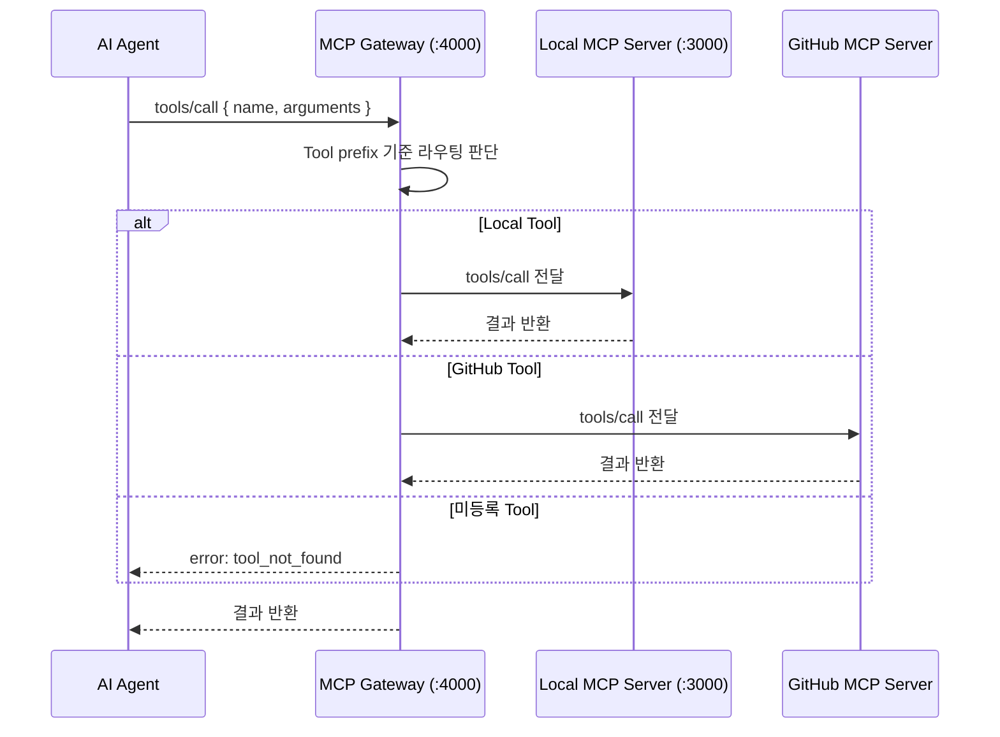
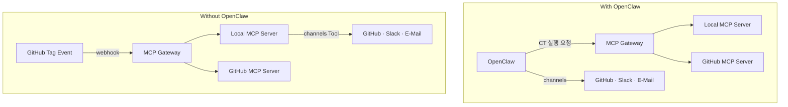

# MCP Gateway

* MCP Gateway
  MCP Server에게 Routing 을 하여 연결하는 기능 

## Overview

MCP Gateway는 여러 MCP Server 앞에 위치하는 라우팅 계층.  
AI Agent(Claude, Codex, Ollama)의 Tool 호출을 수신하고, 등록된 MCP Server 중 적합한 서버로 전달한다.

```
AI Agent
  └─ Tool 호출
       └─ MCP Gateway (:4000)
            ├─ Local MCP Server (:3000)  — 빌드 · 테스트 · 로그 Tool
            └─ GitHub MCP Server         — Repository · PR · Issue Tool
```

---

## VS Code MCP System 

* MCP configuration reference
  https://code.visualstudio.com/docs/copilot/reference/mcp-configuration

* Add and manage MCP servers in VS Code
  https://code.visualstudio.com/docs/copilot/reference/mcp-configuration

* **MCP developer guide**
  https://code.visualstudio.com/api/extension-guides/mcp


## Role

| 구성 요소 | 위치 | 역할 |
|----------|------|------|
| **MCP Gateway** | Local | Tool 호출 수신 · 라우팅 · 응답 반환 |
| [MCP Server-Local](mcp_server.local.md) | Local | `build_tool`, `flash_tool`, `do_test`, `log_analyzer` 등 CT Tool |
| [MCP Server-GitHub](mcp_server_github.md) | Local Process + Remote GitHub API | `PR`, `Issue`, `Repository`, `Actions` Tool |

---

## Routing Rules

Tool 이름 prefix 기준으로 대상 서버를 결정한다.

| Tool prefix / 이름 | 대상 서버 |
|--------------------|-----------|
| `build_*`, `flash_*`, `do_test_*` | Local MCP Server |
| `uart_capture`, `qemu_spawn`, `reg_dump`, `file_read` | Local MCP Server |
| `log_analyzer`, `test_result` | Local MCP Server |
| `channels` | Local MCP Server (Version B) |
| `github_*`, `pr_*`, `issue_*`, `repo_*`, `commit_*`, `workflow_*` | GitHub MCP Server |
| 미등록 Tool | 오류 반환 (`tool_not_found`) |

---

## Protocol Flow



---

## MCP Gateway 

### Version A

**with OpenClaw**

Window WSL 
```
cat ~/.openclaw/openclaw.json
```

```json
...
  "gateway": {
    "mode": "local",
    "auth": {
      "mode": "token",
      "token": "xxxxxxxx"
    },
    "port": 18789,
    "bind": "loopback",
    "tailscale": {
      "mode": "off",
      "resetOnExit": false
    },
    "controlUi": {
      "allowInsecureAuth": true
    },
    "nodes": {
      "denyCommands": [
        "camera.snap",
        "camera.clip",
        "screen.record",
        "contacts.add",
        "calendar.add",
        "reminders.add",
        "sms.send",
        "sms.search"
      ]
    }
  },
...
```

### Version B


* VSCode MCP Gateway 
```
2026-04-17 10:30:15.965 [info] [McpGatewayService] Initialized
```

* VSCode MCP Gateway
```json
{
  "gateway": {
    "name": "openclaw-mcp-gateway",
    "version": "1.0.0",
    "port": 4000
  },
  "servers": {
    "local": {
      "name": "local-mcp-server",
      "url": "http://localhost:3000",
      "enabled": true,
      "tool_prefixes": ["build_", "flash_", "do_test_", "uart_", "qemu_", "reg_", "file_", "log_", "test_", "channels"]
    },
    "github": {
      "name": "github-mcp-server",
      "enabled": true,
      "tool_prefixes": ["github_", "pr_", "issue_", "repo_", "commit_", "workflow_"]
    }
  },
  "logging": {
    "output_dir": "../logs",
    "format": "markdown"
  }
}
```

---

## With / Without OpenClaw

| 구성 | 트리거 수신 | Gateway 역할 |
|------|-----------|-------------|
| **With OpenClaw** | OpenClaw → Gateway | OpenClaw이 채널 담당, Gateway는 Tool 라우팅만 수행 |
| **Without OpenClaw** | GitHub Tag Event → Gateway | Gateway가 채널 라우팅까지 담당 (`channels` Tool 포함) |



---

## Agent Tool Access

| Agent | Tool 호출 대상 | Gateway 경유 |
|-------|--------------|-------------|
| **Local AI** | `build_tool`, `flash_tool`, `do_test_*` | Gateway → Local MCP Server |
| **Sub AI** | `log_analyzer`, `test_result` | Gateway → Local MCP Server |
| **Sub AI** | `pr_*`, `issue_*`, `workflow_*` | Gateway → GitHub MCP Server |
| **Main AI** | Tool 미접근 — 코드·문서 생성 전담 | — |

---

## Related

- [mcp_server.local.md](mcp_server.local.md) — CT Tool 상세 정의, Protocol Flow
- [mcp_server_github.md](mcp_server_github.md) — GitHub MCP Server 44 Tools
- [architecture/system-design.md](../architecture/system-design.md) — 시스템 구조 및 Deployment Diagram
