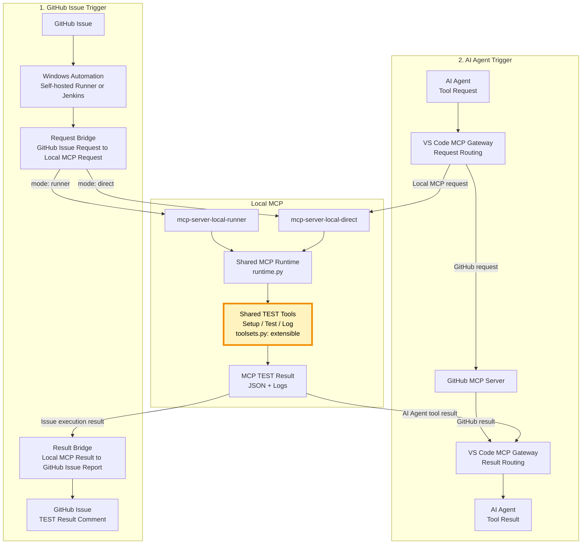
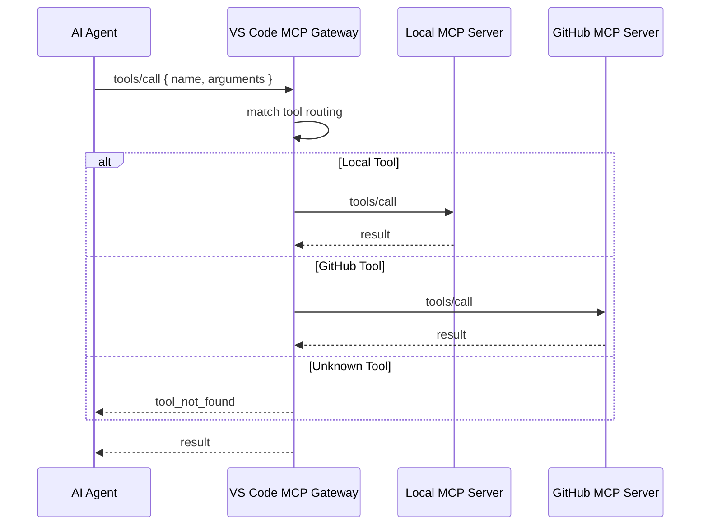

# MCP Gateway

<br/>

## Overview

<br/>

The MCP-based system has two trigger paths.

1. **GitHub Issue Trigger**
   - A GitHub Issue requests CT execution.
   - The Issue label selects the GitHub Self-hosted Runner
     or Jenkins automation path.
   - The shared Python Bridge calls `mcp-server-local-runner`
     or `mcp-server-local-direct`.
2. **AI Agent Trigger**
   - An AI Agent requests a tool through the VS Code
     MCP Gateway.
   - The Gateway discovers and routes tools to the Local
     MCP Server or GitHub MCP Server.


```mermaid
flowchart TD
    subgraph IssueTrigger["1. GitHub Issue Trigger"]
        direction TB
        Issue["GitHub Issue"]
        Automation["Windows Automation<br/>Self-hosted Runner or Jenkins"]
        RequestBridge["Request Bridge<br/>GitHub Issue Request to Local MCP Request"]
        ResultBridge["Result Bridge<br/>Local MCP Result to GitHub Issue Report"]
        IssueComment["GitHub Issue<br/>TEST Result Comment"]

        Issue --> Automation --> RequestBridge
    end

    subgraph AgentTrigger["2. AI Agent Trigger"]
        direction TB
        AgentRequest["AI Agent<br/>Tool Request"]
        RequestGateway["VS Code MCP Gateway<br/>Request Routing"]
        GitHubMCP["GitHub MCP Server"]
        ResultGateway["VS Code MCP Gateway<br/>Result Routing"]
        AgentResult["AI Agent<br/>Tool Result"]

        AgentRequest --> RequestGateway
        RequestGateway -->|GitHub request| GitHubMCP
        GitHubMCP -->|GitHub result| ResultGateway --> AgentResult
    end

    subgraph LocalMCP["Local MCP"]
        direction TB
        RunnerMCP["mcp-server-local-runner"]
        DirectMCP["mcp-server-local-direct"]
        SharedRuntime["Shared MCP Runtime<br/>runtime.py"]
        SharedTools["Shared TEST Tools<br/>Setup / Test / Log<br/>toolsets.py: extensible"]
        TestResult["MCP TEST Result<br/>JSON + Logs"]
    end

    RequestBridge -->|mode: runner| RunnerMCP
    RequestBridge -->|mode: direct| DirectMCP
    RequestGateway -->|Local MCP request| DirectMCP

    RunnerMCP --> SharedRuntime
    DirectMCP --> SharedRuntime
    SharedRuntime --> SharedTools --> TestResult

    TestResult -->|Issue execution result| ResultBridge --> IssueComment
    TestResult -->|AI Agent tool result| ResultGateway

    classDef sharedTools fill:#fff3bf,stroke:#f08c00,stroke-width:4px,color:#000;
    class SharedTools sharedTools;
```

!!! note "Trigger Boundary"
    * The AI Agent Trigger uses the VS Code MCP Gateway.
    * The GitHub Issue Trigger does not pass through the
      VS Code MCP Gateway.
    * The GitHub Issue Trigger uses automation and the shared
      Python Bridge to call a Local MCP Server.

!!! success "Shared TEST Tool Extensibility"
    * `toolsets.py` owns the shared Setup, Test, and Log
      tool catalogs.
    * A new tool is added to the appropriate catalog with its
      description, schema, default arguments, and handler.
    * `LOCAL_TOOLS` and `LOCAL_HANDLERS` are generated from
      the shared catalog.
    * Runner MCP and Direct MCP therefore expose the same
      extended TEST tools without duplicated implementations.
    * Third-party packages required by a new tool are added to
      `mcp_requirements.txt` for both CT paths.

<br/>

---

## Current MCP Source Mapping

<br/>

The two Trigger paths are implemented with the following repository sources.

| Trigger | Source | Role |
|------|------|------|
| GitHub Issue | `.github/workflows/test_request_local.yaml` | starts Runner CT through GitHub Actions |
| GitHub Issue | `Jenkinsfile` | starts Direct CT through a GitHub webhook |
| Shared Bridge | `mcp/scripts/run_test_request.py` | parses the Issue and selects an MCP Server |
| Shared Bridge | `mcp/scripts/make_test_result.py` | converts TEST results into Issue Markdown |
| Runner MCP | `mcp/server_local_runner/server.py` | Runner mode MCP entrypoint |
| Direct MCP | `mcp/server_local_direct/server.py` | Direct mode MCP entrypoint |
| Shared MCP | `mcp/server_local/runtime.py` | MCP stdio protocol and logging |
| Shared MCP | `mcp/server_local/toolsets.py` | Setup, Test, and Log tools |
| MCP Dependencies | `mcp_requirements.txt` | shared Python packages for both CT paths |
| AI Agent | `.vscode/mcp.json` | registers MCP Servers with VS Code |

```text
mcp/
  scripts/
    run_test_request.py       # Request Bridge
    make_test_result.py       # Result Bridge
  server_local_runner/
    server.py                 # Runner MCP entrypoint
  server_local_direct/
    server.py                 # Direct MCP entrypoint
  server_local/
    runtime.py                # Shared MCP runtime
    toolsets.py               # Shared TEST tools
```

Current source execution paths:

1. **GitHub Issue Trigger: Self-hosted Runner**

   ```text
   test_request_local.yaml
     -> run_test_request.py
     -> server_local_runner/server.py
     -> runtime.py + toolsets.py
     -> make_test_result.py
     -> GitHub Issue comment
   ```

2. **GitHub Issue Trigger: Jenkins**

   ```text
   Jenkinsfile
     -> run_test_request.py
     -> server_local_direct/server.py
     -> runtime.py + toolsets.py
     -> make_test_result.py
     -> GitHub Issue comment
   ```

3. **AI Agent Trigger: Current Local MCP**

   ```text
   .vscode/mcp.json
     -> server_local_direct/server.py
     -> runtime.py + toolsets.py
     -> MCP tool result
     -> AI Agent
   ```

!!! note "Current VS Code MCP Configuration"
    * `.vscode/mcp.json` currently registers only
      `mcp-server-local-direct`.
    * The configured module is
      `mcp.server_local_direct.server`.
    * The GitHub MCP Server is part of the Gateway design,
      but it is not registered in the current repository
      `.vscode/mcp.json`.

!!! tip "Shared MCP Implementation"
    * Runner and Direct are two MCP Server entrypoints.
    * Both entrypoints import the same `MCPServer`,
      `LOCAL_TOOLS`, and `LOCAL_HANDLERS` implementation.
    * Setup, Test, and Log capabilities are extended in
      `mcp/server_local/toolsets.py` and shared by both servers.
    * The Python Bridge selects the entrypoint from the Issue
      field `MCP Server Mode`.

<br/>

---

## MCP Purpose

<br/>

- AI Agent to Local Tool connection
- AI Agent to GitHub resource connection
- common tool call path
- execution layer and collaboration layer split

<br/>

---

### AI Agent Connection Purpose

<br/>

- shell command dependency reduction
- common interface for build, flash, test, log tools
- unified access to Issue, Pull Request, Review, Actions
- agent role based tool selection

<br/>

---

## Deployment Note

<br/>

- Reference model
  - Main AI, Sub AI, Local AI role split
- Practical model
  - one Remote AI Agent can cover Main AI + Sub AI together
  - Local AI is optional
- Interpretation
  - role split is a documentation model
  - runtime deployment can use 1, 2, or 3 agents

<br/>

---

## Role

<br/>

| Component | Location | Role |
|------|------|------|
| VS Code MCP Gateway | VS Code internal | MCP Server connection, tool discovery, tool routing |
| [MCP Server-Local](mcp_server_local.md) | Local | `build_tool`, `flash_tool`, `do_test_*`, `log_analyzer`, `test_result` |
| [MCP Server-GitHub](mcp_server_github.md) | Local Process + Remote GitHub API | `pr_*`, `issue_*`, `repo_*`, `workflow_*` |

<br/>

---

## Current Usage

<br/>

1. VS Code reads `.vscode/mcp.json`.
2. VS Code connects MCP servers.
3. AI Agent selects tools by task.
4. Gateway routes the call to the matched MCP Server.

Notes:

- VS Code MCP Gateway is a connection hub.
- It is not a full workflow engine.
- end-to-end CT orchestration still needs workflow logic outside the gateway.

<br/>

---

## Routing Rules

<br/>

| Tool Prefix | Target Server |
|------|------|
| `build_*`, `flash_*`, `do_test_*` | Local MCP Server |
| `uart_capture`, `qemu_spawn`, `reg_dump`, `file_read` | Local MCP Server |
| `log_analyzer`, `test_result` | Local MCP Server |
| `github_*`, `pr_*`, `issue_*`, `repo_*`, `commit_*`, `workflow_*` | GitHub MCP Server |

<br/>

---

## Protocol Flow

<br/>


```mermaid
sequenceDiagram
    participant A as AI Agent
    participant G as VS Code MCP Gateway
    participant L as Local MCP Server
    participant GH as GitHub MCP Server

    A->>G: tools/call { name, arguments }
    G->>G: match tool routing

    alt Local Tool
        G->>L: tools/call
        L-->>G: result
    else GitHub Tool
        G->>GH: tools/call
        GH-->>G: result
    else Unknown Tool
        G-->>A: tool_not_found
    end

    G-->>A: result
```

<br/>

---

## Gateway Scope

<br/>

- covered
  - MCP Server connection
  - tool discovery
  - tool call routing
- not covered
  - GitHub event webhook receive
  - result polling
  - automatic result analysis chaining
  - automatic final report posting

<br/>

---

## Agent Tool Access

<br/>

| Agent | Tool Access Target | Gateway Path |
|------|------|------|
| Local AI | `build_tool`, `flash_tool`, `do_test_*` | Gateway -> Local MCP Server |
| Sub AI | `log_analyzer`, `test_result` | Gateway -> Local MCP Server |
| Sub AI | `pr_*`, `issue_*`, `workflow_*` | Gateway -> GitHub MCP Server |
| Main AI | optional, usually code and document focused | optional |

Notes:

- This table is a role reference.
- One Remote AI Agent can handle both Main AI and Sub AI responsibilities.
- A single Remote AI Agent can use GitHub tools and result analysis tools together.
- Local AI is an optional helper, not a mandatory deployment unit.

<br/>

---

## CI/CD/CT Relation

<br/>

---

### Direct MCP Path

<br/>

```text
AI Agent
  -> VS Code MCP Gateway
  -> Local MCP Server or GitHub MCP Server
```

<br/>

---

### GitHub Issue Based CT Path

<br/>

```text
GitHub Issue
  -> GitHub Actions or Jenkins
  -> Python bridge
  -> Local MCP Server
  -> JSON / log / comment
```

Notes:

- `test-request-runner`
  - GitHub Actions + self-hosted runner path
- `test-request-direct`
  - Jenkins direct execution path
- both paths are outside the VS Code internal gateway scope

<br/>

---

## Related

<br/>

- [MCP Server-Local](mcp_server_local.md)
- [MCP Server-GitHub](mcp_server_github.md)
- [System Design](../architecture/system-design.md)

<br/>

---
