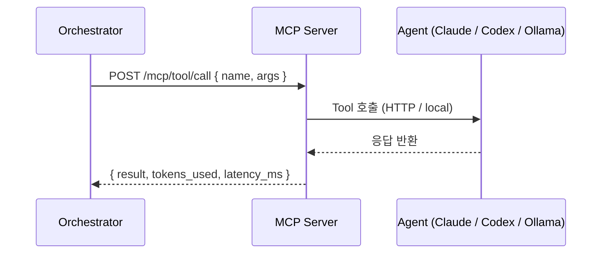

# MCP Server

## Overview

MCP(Model Context Protocol) 서버는 Orchestrator와 AI Agent 사이의 전송 레이어 역할을 합니다.   
각 Agent는 Orchestrator가 호출할 수 있는 Tool로 등록됩니다.

## Server Setup

**Windows / Linux 공통**
```bash
# MCP SDK 설치
npm install @modelcontextprotocol/sdk

# 서버 시작
node mcp-server.js
```

## Registered Tools

| Tool 이름      | Agent | 설명                              |
|-------------|---------|-----------------------------------|
| `codex.run`  | Codex   | 코드 생성 Prompt 실행             |
| `claude.run` | Claude  | 추론/텍스트 Prompt 실행           |
| `ollama.run` | Ollama  | 로컬 추론 Prompt 실행             |
| `log.write`  | System  | 구조화된 실행 로그 항목 작성        |

## Tool Definition Example

```json
{
  "name": "claude.run",
  "description": "Claude에 Prompt를 보내고 응답을 반환합니다.",
  "inputSchema": {
    "type": "object",
    "properties": {
      "prompt": { "type": "string" },
      "context": { "type": "string" },
      "model": { "type": "string", "default": "claude-sonnet-4-6" }
    },
    "required": ["prompt"]
  }
}
```

## Server Configuration (`mcp-config.json`)

```json
{
  "server": {
    "name": "openclaw-mcp",
    "version": "0.1.0",
    "port": 3000
  },
  "agents": {
    "claude": { "enabled": true },
    "codex": { "enabled": true },
    "ollama": { "enabled": true, "base_url": "http://localhost:11434" }
  },
  "logging": {
    "output_dir": "../logs",
    "format": "markdown"
  }
}
```

## Protocol Flow



| 필드 | 설명 |
|------|------|
| `name` | Tool 이름 (예: `claude.run`) |
| `args` | Tool 인자 (예: `{ prompt: "..." }`) |
| `result` | Agent 응답 텍스트 |
| `tokens_used` | 소비된 Token 수 |
| `latency_ms` | 응답 지연 시간 (ms) |

## Notes

- 기본적으로 `localhost:3000`에서 실행
- `logging.format` 설정 시 모든 Tool 호출 자동 로깅
- 새 Agent 추가: 새 Tool 정의와 Adapter 등록으로 확장 가능
