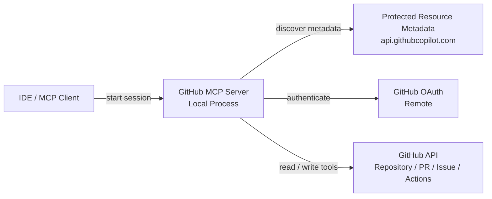

# GitHub MCP Server

* VSCode Extension -> MCP Servers     


* Manaul
https://docs.github.com/en/copilot/how-tos/provide-context/use-mcp-in-your-ide/use-the-github-mcp-server

* Node.js 
https://github.com/github/github-mcp-server 


## Overview

GitHub 대상 MCP(Model Context Protocol) `Tool` 제공용 전용 서버.

## Current Position In This Repository

현재 저장소에서 GitHub MCP Server는 IDE 안에서 GitHub 리소스와 Actions 정보를 조회하거나 갱신할 때 사용하는 MCP 서버다.

현재 구현 기준:

- TEST Request 자동 실행 경로는 GitHub MCP Server가 직접 트리거하지 않는다
- 현재 자동 경로는 `GitHub Issue -> GitHub Actions -> Python bridge -> Local MCP Server`이다
- GitHub MCP Server는 결과 조회, 후속 댓글 작성, 상태 반영 같은 후처리 연계 지점으로 남아 있다

즉 현재 구현에서 GitHub MCP Server는 Issue 이벤트를 받아 Local MCP Server를 직접 중계하는 오케스트레이터가 아니다.

VS Code MCP Server Github Log:
```log
2026-04-17 10:33:22.770 [info] Starting server io.github.github/github-mcp-server
2026-04-17 10:33:22.770 [info] Connection state: Starting
2026-04-17 10:33:22.770 [info] Starting server from LocalProcess extension host
2026-04-17 10:33:22.771 [info] Connection state: Running
2026-04-17 10:33:25.037 [info] Discovered resource metadata at https://api.githubcopilot.com/.well-known/oauth-protected-resource/mcp/
2026-04-17 10:33:25.037 [info] Using auth server metadata url: https://github.com/login/oauth
2026-04-17 10:33:25.440 [info] Discovered authorization server metadata at https://github.com/.well-known/oauth-authorization-server/login/oauth
2026-04-17 10:33:33.737 [info] Discovered 44 tools
```

- GitHub 전용 MCP Server 
- Local 실행 + Remote GitHub 인증/데이터 구조


---

## MCP Server-Gitub

상위 아이콘의 설정메뉴에서 확인 

* **Default Manaul**    
    https://docs.github.com/en/copilot/how-tos/provide-context/use-mcp-in-your-ide/set-up-the-github-mcp-server

* **JSON Setup**   
    https://github.com/github/github-mcp-server/blob/main/docs/server-configuration.md


### VS Code Config

* MCP Server Setup (Remote/HTTP)
```json
{
	"servers": {
		"io.github.github/github-mcp-server": {
			"type": "http",
			"url": "https://api.githubcopilot.com/mcp/",
			"gallery": "https://api.mcp.github.com",
			"version": "0.33.0"
		}
	},
	"inputs": []
}
```

### Capabilities

주요 기능군:

- `Repository` 조회 / 검색
- `Pull Request` 조회 / diff / review
- `Issue` 생성 / 수정 / label / assignee
- `Commit` / `Branch` / `File` 조회 및 갱신
- `GitHub Actions` run / job / step / log
- `Review Thread` / `Reaction` / reply / resolve

### Capability Diagram



### Roles 

| No. | Inferred Role Group | Example Tasks | Verification |
|------|------|-----------|------|
| 1 | `Repository Metadata` | 저장소 정보, default branch | Inferred |
| 2 | `Repository Search` | 접근 가능한 저장소 검색 | Inferred |
| 3 | `Branch Search` | branch 검색, 기준 branch 선택 | Inferred |
| 4 | `File Fetch` | 특정 ref 파일 조회 | Inferred |
| 5 | `Blob Fetch` | blob SHA 기반 조회 | Inferred |
| 6 | `Commit Fetch` | 단일 commit 메타데이터, 변경 내용 | Inferred |
| 7 | `Commit Compare` | 두 ref 간 변경 파일, 통계 비교 | Inferred |
| 8 | `Commit Search` | commit 검색 | Inferred |
| 9 | `Commit Status` | combined status, check 결과 | Inferred |
| 10 | `Workflow Run Lookup` | 특정 commit의 Actions run | Inferred |
| 11 | `Workflow Jobs` | run 내 job 목록 | Inferred |
| 12 | `Workflow Steps` | job step 상태 | Inferred |
| 13 | `Workflow Logs` | 실패 job log | Inferred |
| 14 | `PR Metadata` | PR 제목, 상태, base/head branch | Inferred |
| 15 | `PR Diff` | PR diff, patch | Inferred |
| 16 | `PR Patch By File` | 파일 단위 PR patch | Inferred |
| 17 | `PR File List` | 변경 파일 목록 | Inferred |
| 18 | `PR Discussion` | PR comment, review comment, review event | Inferred |
| 19 | `PR Reviews` | review 목록 | Inferred |
| 20 | `PR Review Threads` | inline review thread, resolve 상태 | Inferred |
| 21 | `PR Reactions` | reaction 조회, 추가 | Inferred |
| 22 | `PR Comment Reply` | inline review comment reply | Inferred |
| 23 | `PR Review Submit` | approve, request changes, review 제출 | Inferred |
| 24 | `PR Reviewer Request` | reviewer, team reviewer 요청 | Inferred |
| 25 | `PR Ready/Draft` | Draft, Ready for Review 전환 | Inferred |
| 26 | `PR Update` | 제목, 본문, 상태, base branch 수정 | Inferred |
| 27 | `PR Merge` | merge, squash, rebase | Inferred |
| 28 | `PR Auto Merge` | auto-merge | Inferred |
| 29 | `Issue Fetch` | Issue 본문, 상태, 메타데이터 | Inferred |
| 30 | `Issue Comments` | Issue comment | Inferred |
| 31 | `Issue Create` | Issue 생성 | Inferred |
| 32 | `Issue Update` | 제목, 본문, 상태, milestone 수정 | Inferred |
| 33 | `Issue Labels` | label 추가, 제거 | Inferred |
| 34 | `Issue Assignees` | assignee 추가, 제거 | Inferred |
| 35 | `Issue Lock` | conversation lock, unlock | Inferred |
| 36 | `Issue Comment Update` | top-level comment 수정 | Inferred |
| 37 | `Issue Reactions` | Issue comment reaction | Inferred |
| 38 | `File Create` | 파일 생성 | Inferred |
| 39 | `File Update` | 파일 수정 | Inferred |
| 40 | `File Delete` | 파일 삭제 | Inferred |
| 41 | `Blob Create` | blob 생성 | Inferred |
| 42 | `Tree Create` | Git tree 생성 | Inferred |
| 43 | `Commit Create` | Git commit 생성 | Inferred |
| 44 | `Ref Update` | branch ref 이동, branch 생성 | Inferred |

### Practical Grouping

| Group | Included Capabilities |
|------|-----------|
| Read | `Repository`, `File`, `Commit`, `PR`, `Issue` 조회 |
| Search | `Repository`, `Branch`, code, `PR`, `Issue`, `Commit` 검색 |
| Collaboration | `Review`, comment, reaction, label, assignee |
| CI / Verification | `Actions` run, job, step, log |
| Write | 파일 생성/수정/삭제, branch, commit, merge |

---

## Custom Tool Extensibility

### Conclusion

확장 가능성은 있으나, 현재 문서의 근거만으로는 범위를 단정할 수 없음.

구분 기준:

- GitHub MCP Server 내부 확장
- 별도 Custom MCP Server 추가
- Wrapper / Orchestrator 계층 추가

| Approach | Confidence | Description |
|------|-----------|------|
| Modify GitHub MCP Server itself | Medium | 서버 소스 접근 가능 시 `Tool` 추가 가능성이 높음 |
| Add tools by config only | Low | 설정만으로 임의 `Tool` 추가 가능 여부는 현재 근거 부족 |
| Add a separate Custom MCP Server | High | GitHub 전용 서버와 별도 프로젝트 서버 병행은 일반적으로 현실적 |
| Build a Wrapper Server | High | 여러 GitHub `Tool` 호출을 상위 `Tool`로 추상화하는 방식은 일반적으로 가능 |

### A. Extend the GitHub MCP Server Itself

예시:

- `create_release_summary()`
- `bulk_label_pull_requests()`
- `sync_project_board_item()`

장점:

- GitHub 기능과 직접 통합
- 단일 MCP Server 관점

주의:

- 공식 서버 직접 수정 난이도
- 업스트림 업데이트 시 유지보수 비용

### B. Add a Separate Custom MCP Server

예시:

- `ct_report_publish()`
- `jira_sync()`
- `firmware_test_summary()`
- `local_policy_check()`

장점:

- GitHub MCP Server 비수정
- 프로젝트별 기능 자유도
- 운영 측면 현실성

주의:

- MCP Client 추가 등록 필요
- 역할 경계 문서화 필요

### C. Add a Wrapper / Orchestrator Tool

예시:

- `prepare_release_pr()`
- `review_failed_ci_and_comment()`

조합 예:

1. PR 조회
2. 변경 파일 목록 확인
3. Actions 실패 log 수집
4. comment 작성
5. label 추가

장점:

- 사용자 직접 조합 부담 감소
- workflow 표준화 용이
