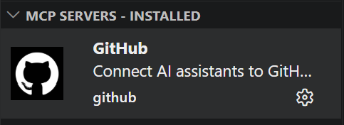
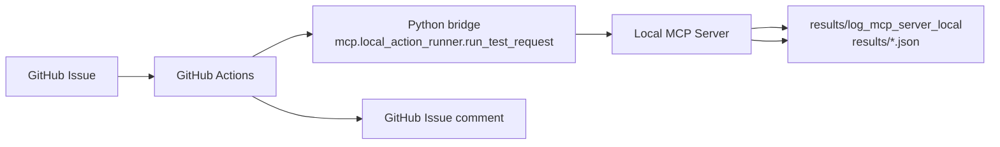

# GitHub MCP Server



## References

- Manual: <https://docs.github.com/en/copilot/how-tos/provide-context/use-mcp-in-your-ide/use-the-github-mcp-server>
- Node.js server: <https://github.com/github/github-mcp-server>

## Overview

GitHub MCP Server는 VS Code 같은 MCP Client에서 GitHub 자원을 읽고 쓰기 위한 MCP Server.

현재 저장소 기준 역할:

- GitHub Repository, Issue, Pull Request, Actions 정보 조회
- GitHub Issue, comment, label, assignee 같은 협업 정보 갱신
- Local MCP Server 기반 TEST 흐름의 GitHub 측 연계

직접 Local test tool을 실행하는 주체는 아님.

---

## Current Position In This Repository

현재 자동 TEST 흐름:

```text
GitHub Issue
  -> GitHub Actions
  -> Python bridge
  -> Local MCP Server
  -> results/log_mcp_server_local + results JSON
  -> GitHub Issue comment
```

의미:

- GitHub MCP Server: GitHub 측 조회 / 갱신 담당
- Local MCP Server: 실제 tool 실행 담당
- GitHub Actions: Issue 기반 자동화 bridge 담당

즉 현재 구조에서 GitHub MCP Server는 Local tool 실행 경로를 직접 host 하거나 trigger 하는 주체가 아니라, GitHub 연계 역할에 집중.

### Flow



---

## VS Code Configuration

VS Code MCP server setup 예시:

```json
{
  "servers": {
    "io.github.github/github-mcp-server": {
      "type": "http",
      "url": "https://api.githubcopilot.com/mcp/",
      "gallery": "https://api.mcp.github.com",
      "version": "0.33.0"
    }
  },
  "inputs": []
}
```

---

## Example Startup Log

```log
2026-04-17 10:33:22.770 [info] Starting server io.github.github/github-mcp-server
2026-04-17 10:33:22.770 [info] Connection state: Starting
2026-04-17 10:33:22.770 [info] Starting server from LocalProcess extension host
2026-04-17 10:33:22.771 [info] Connection state: Running
2026-04-17 10:33:25.037 [info] Discovered resource metadata at https://api.githubcopilot.com/.well-known/oauth-protected-resource/mcp/
2026-04-17 10:33:25.037 [info] Using auth server metadata url: https://github.com/login/oauth
2026-04-17 10:33:25.440 [info] Discovered authorization server metadata at https://github.com/.well-known/oauth-authorization-server/login/oauth
2026-04-17 10:33:33.737 [info] Discovered 44 tools
```

---

## Main Capabilities

주요 capability group:

- Repository 조회 / 검색
- branch, commit, file 조회
- Issue 생성 / 수정 / label / assignee / comment 처리
- Pull Request 조회 / diff / review / merge 처리
- GitHub Actions run / job / step / log 조회

실무 관점에서는 GitHub 측 control plane 역할.

### Roles

| No. | Role Group | Example Tasks | Verification |
|------|------|-----------|------|
| 1 | `Repository Metadata` | 저장소 정보, default branch 조회 | Inferred |
| 2 | `Repository Search` | 접근 가능한 저장소 검색 | Inferred |
| 3 | `Branch Search` | branch 검색, 기준 branch 선택 | Inferred |
| 4 | `File Fetch` | 특정 ref 파일 조회 | Inferred |
| 5 | `Blob Fetch` | blob SHA 기반 조회 | Inferred |
| 6 | `Commit Fetch` | 단일 commit 메타데이터, 변경 내용 조회 | Inferred |
| 7 | `Commit Compare` | 두 ref 간 변경 파일, 통계 비교 | Inferred |
| 8 | `Commit Search` | commit 검색 | Inferred |
| 9 | `Commit Status` | combined status, check 결과 조회 | Inferred |
| 10 | `Workflow Run Lookup` | 특정 commit의 Actions run 조회 | Inferred |
| 11 | `Workflow Jobs` | run 내부 job 목록 조회 | Inferred |
| 12 | `Workflow Steps` | job step 상태 조회 | Inferred |
| 13 | `Workflow Logs` | 실패 job log 조회 | Inferred |
| 14 | `PR Metadata` | PR 제목, 상태, base/head branch 조회 | Inferred |
| 15 | `PR Diff` | PR diff, patch 조회 | Inferred |
| 16 | `PR Patch By File` | 파일 단위 PR patch 조회 | Inferred |
| 17 | `PR File List` | 변경 파일 목록 조회 | Inferred |
| 18 | `PR Discussion` | PR comment, review comment, review event 조회 | Inferred |
| 19 | `PR Reviews` | review 목록 조회 | Inferred |
| 20 | `PR Review Threads` | inline review thread, resolve 상태 조회 | Inferred |
| 21 | `PR Reactions` | reaction 조회, 추가 | Inferred |
| 22 | `PR Comment Reply` | inline review comment reply 작성 | Inferred |
| 23 | `PR Review Submit` | approve, request changes, review 제출 | Inferred |
| 24 | `PR Reviewer Request` | reviewer, team reviewer 요청 | Inferred |
| 25 | `PR Ready/Draft` | Draft, Ready for Review 전환 | Inferred |
| 26 | `PR Update` | 제목, 본문, 상태, base branch 수정 | Inferred |
| 27 | `PR Merge` | merge, squash, rebase 실행 | Inferred |
| 28 | `PR Auto Merge` | auto-merge 설정 | Inferred |
| 29 | `Issue Fetch` | Issue 본문, 상태, 메타데이터 조회 | Inferred |
| 30 | `Issue Comments` | Issue comment 조회 | Inferred |
| 31 | `Issue Create` | Issue 생성 | Inferred |
| 32 | `Issue Update` | 제목, 본문, 상태, milestone 수정 | Inferred |
| 33 | `Issue Labels` | label 추가, 제거 | Inferred |
| 34 | `Issue Assignees` | assignee 추가, 제거 | Inferred |
| 35 | `Issue Lock` | conversation lock, unlock | Inferred |
| 36 | `Issue Comment Update` | top-level comment 수정 | Inferred |
| 37 | `Issue Reactions` | Issue comment reaction 처리 | Inferred |
| 38 | `File Create` | 파일 생성 | Inferred |
| 39 | `File Update` | 파일 수정 | Inferred |
| 40 | `File Delete` | 파일 삭제 | Inferred |
| 41 | `Blob Create` | blob 생성 | Inferred |
| 42 | `Tree Create` | Git tree 생성 | Inferred |
| 43 | `Commit Create` | Git commit 생성 | Inferred |
| 44 | `Ref Update` | branch ref 이동, branch 생성 | Inferred |

### Practical Grouping

| Group | Included Capabilities |
|------|-----------|
| Read | `Repository`, `File`, `Commit`, `PR`, `Issue` 조회 |
| Search | `Repository`, `Branch`, code, `PR`, `Issue`, `Commit` 검색 |
| Collaboration | `Review`, comment, reaction, label, assignee |
| CI / Verification | `Actions` run, job, step, log |
| Write | 파일 생성 / 수정 / 삭제, branch, commit, merge |

---

## Role Separation

현재 역할 분리:

- GitHub MCP Server
   - GitHub 상태 조회
   - Issue / comment / review / Actions 결과 조회 및 갱신
- Local MCP Server
   - `build_tool`, `flash_tool`, `log_analyzer` 같은 local tool 실행
   - log file, result JSON 저장
- GitHub Actions
   - Issue event와 Local MCP 실행 경로 연결

이 구분이 중요한 이유는, IDE 안에 GitHub MCP Server가 있어도 Issue 기반 Local TEST는 workflow runner 의존성이 남는다는 점을 설명하기 때문.

---

## Related

- [mcp_server_local.md](mcp_server_local.md)
- [mcp_gateway.md](mcp_gateway.md)
- [github_templates.md](../github/github_templates.md)
- [self-hosted_runner.md](../github/self-hosted_runner.md)
