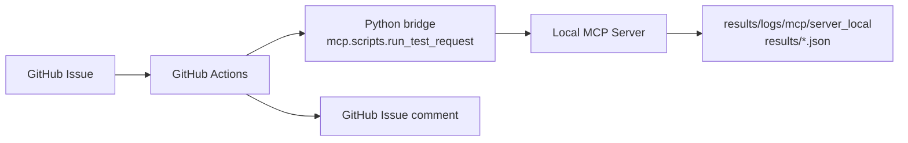

# GitHub MCP Server


## References

- Manual: <https://docs.github.com/en/copilot/how-tos/provide-context/use-mcp-in-your-ide/use-the-github-mcp-server>
- Node.js server: <https://github.com/github/github-mcp-server>

---

## Overview

GitHub MCP Server is the MCP Server used by MCP clients such as VS Code to read and update GitHub resources.

Current role in this repository:

- Repository, Issue, Pull Request, and Actions access
- Issue, comment, label, and assignee updates
- GitHub-side integration for the Local MCP based TEST flow

It is not the component that directly executes local test tools.

---

## Current Position In This Repository

Current automated TEST flow:

```text
GitHub Issue
  -> GitHub Actions
  -> Python bridge
  -> Local MCP Server
  -> results/logs/mcp/server_local + results JSON
  -> GitHub Issue comment
```

Meaning:

- GitHub MCP Server
  - GitHub-side read and write operations
- Local MCP Server
  - actual tool execution
- GitHub Actions
  - Issue-based automation bridge

In the current structure, GitHub MCP Server does not host or trigger the local tool execution path directly. Its focus is GitHub integration.

### Flow



---

## VS Code Configuration

Example:

```json
{
  "servers": {
    "io.github.github/github-mcp-server": {
      "type": "http",
      "url": "https://api.githubcopilot.com/mcp/",
      "gallery": "https://api.mcp.github.com",
      "version": "0.33.0"
    }
  },
  "inputs": []
}
```

---

## Example Startup Log

```log
2026-04-17 10:33:22.770 [info] Starting server io.github.github/github-mcp-server
2026-04-17 10:33:22.770 [info] Connection state: Starting
2026-04-17 10:33:22.770 [info] Starting server from LocalProcess extension host
2026-04-17 10:33:22.771 [info] Connection state: Running
2026-04-17 10:33:25.037 [info] Discovered resource metadata at https://api.githubcopilot.com/.well-known/oauth-protected-resource/mcp/
2026-04-17 10:33:25.037 [info] Using auth server metadata url: https://github.com/login/oauth
2026-04-17 10:33:25.440 [info] Discovered authorization server metadata at https://github.com/.well-known/oauth-authorization-server/login/oauth
2026-04-17 10:33:33.737 [info] Discovered 44 tools
```

---

## Main Capabilities

Capability groups:

- Repository lookup and search
- branch, commit, and file lookup
- Issue creation, update, labels, assignees, and comments
- Pull Request lookup, diff, review, and merge
- GitHub Actions runs, jobs, steps, and logs

Operationally, this is the GitHub control plane.

### Roles

| No. | Role Group | Example Tasks | Verification |
|------|------|-----------|------|
| 1 | `Repository Metadata` | repository metadata, default branch lookup | Inferred |
| 2 | `Repository Search` | accessible repository search | Inferred |
| 3 | `Branch Search` | branch search and base branch selection | Inferred |
| 4 | `File Fetch` | fetch file by ref | Inferred |
| 5 | `Blob Fetch` | fetch by blob SHA | Inferred |
| 6 | `Commit Fetch` | single commit metadata and change lookup | Inferred |
| 7 | `Commit Compare` | compare changed files and stats between refs | Inferred |
| 8 | `Commit Search` | commit search | Inferred |
| 9 | `Commit Status` | combined status and check result lookup | Inferred |
| 10 | `Workflow Run Lookup` | lookup Actions runs for a commit | Inferred |
| 11 | `Workflow Jobs` | workflow job listing | Inferred |
| 12 | `Workflow Steps` | workflow step status lookup | Inferred |
| 13 | `Workflow Logs` | failed job log lookup | Inferred |
| 14 | `PR Metadata` | PR title, status, base and head branch | Inferred |
| 15 | `PR Diff` | PR diff and patch | Inferred |
| 16 | `PR Patch By File` | per-file PR patch lookup | Inferred |
| 17 | `PR File List` | changed file listing | Inferred |
| 18 | `PR Discussion` | PR comments, review comments, review events | Inferred |
| 19 | `PR Reviews` | review listing | Inferred |
| 20 | `PR Review Threads` | inline review thread and resolution status | Inferred |
| 21 | `PR Reactions` | reaction lookup and creation | Inferred |
| 22 | `PR Comment Reply` | inline review comment reply | Inferred |
| 23 | `PR Review Submit` | approve, request changes, submit review | Inferred |
| 24 | `PR Reviewer Request` | request reviewer or team reviewer | Inferred |
| 25 | `PR Ready/Draft` | change Draft or Ready for Review state | Inferred |
| 26 | `PR Update` | update title, body, state, or base branch | Inferred |
| 27 | `PR Merge` | merge, squash, or rebase | Inferred |
| 28 | `PR Auto Merge` | enable auto-merge | Inferred |
| 29 | `Issue Fetch` | Issue body, state, metadata | Inferred |
| 30 | `Issue Comments` | Issue comment lookup | Inferred |
| 31 | `Issue Create` | create Issue | Inferred |
| 32 | `Issue Update` | update title, body, state, or milestone | Inferred |
| 33 | `Issue Labels` | add or remove labels | Inferred |
| 34 | `Issue Assignees` | add or remove assignees | Inferred |
| 35 | `Issue Lock` | lock or unlock conversation | Inferred |
| 36 | `Issue Comment Update` | update top-level comment | Inferred |
| 37 | `Issue Reactions` | Issue comment reactions | Inferred |
| 38 | `File Create` | create file | Inferred |
| 39 | `File Update` | update file | Inferred |
| 40 | `File Delete` | delete file | Inferred |
| 41 | `Blob Create` | create blob | Inferred |
| 42 | `Tree Create` | create Git tree | Inferred |
| 43 | `Commit Create` | create Git commit | Inferred |
| 44 | `Ref Update` | move branch ref or create branch | Inferred |

### Practical Grouping

| Group | Included Capabilities |
|------|-----------|
| Read | `Repository`, `File`, `Commit`, `PR`, `Issue` lookup |
| Search | `Repository`, `Branch`, code, `PR`, `Issue`, `Commit` search |
| Collaboration | `Review`, comment, reaction, label, assignee |
| CI / Verification | `Actions` runs, jobs, steps, logs |
| Write | file create, update, delete, branch, commit, merge |

---

## Role Separation

Current separation:

- GitHub MCP Server
  - GitHub state lookup
  - Issue, comment, review, and Actions result lookup and update
- Local MCP Server
  - local tool execution such as `build_tool`, `flash_tool`, and `log_analyzer`
  - log files and result JSON output
- GitHub Actions
  - bridge between Issue events and Local MCP execution

This distinction matters because even if GitHub MCP Server is available inside the IDE, Issue-based local TEST execution still depends on the workflow runner path.

---

## Related

- [MCP Server-Local](mcp_server_local.md)
- [MCP Gateway](mcp_gateway.md)
- [GitHub Templates](../envs/github_templates.md)
- [GitHub Self Hosted Runner](../envs/github_self_hosted_runner.md)
