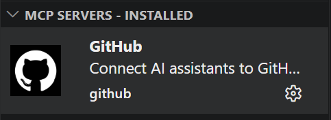
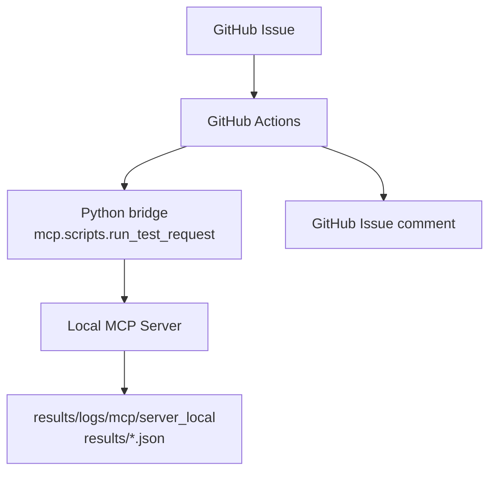

# GitHub MCP Server

<br/>



## References

<br/>

- Manual: <https://docs.github.com/en/copilot/how-tos/provide-context/use-mcp-in-your-ide/use-the-github-mcp-server>
- Node.js server: <https://github.com/github/github-mcp-server>

<br/>

---

## Overview

<br/>

GitHub MCP Server is an external MCP Server used by MCP clients such as VS Code to read and update GitHub resources.

Current role in this repository:

- AI Agent access to GitHub Issues
- Issue creation, lookup, update, and follow-up
- optional access to other GitHub resources when enabled

It is not included in this repository's Python MCP source and does not directly execute local TEST tools.

!!! warning "Separate VS Code Installation Required"
    * GitHub MCP Server must be installed or registered
      separately in VS Code.
    * GitHub authentication is also required before an
      AI Agent can use its GitHub tools.
    * The repository `.vscode/mcp.json` currently registers
      only `mcp-server-local-direct`.
    * Installing repository Python dependencies does not
      install or configure GitHub MCP Server.

<br/>

---

## Current Position In This Repository

<br/>

Current automated TEST flow:

```text
GitHub Issue
  -> GitHub Actions
  -> Python bridge
  -> Local MCP Server
  -> results/logs/mcp/server_local + results JSON
  -> GitHub Issue comment
```

Meaning:

- Local MCP Server performs the actual TEST tool execution.
- GitHub Actions triggers the Self-hosted Runner CT flow.
- `actions/github-script` posts the result comment.
- Jenkins uses the GitHub REST API for its result comment.

!!! note "Current Source Usage"
    * The automated CT source does not call GitHub MCP Server.
    * GitHub MCP Server is an optional AI Agent integration.
    * Its primary project role is GitHub Issue interaction
      from VS Code after separate installation.

<br/>

---

### Flow

<br/>


```mermaid
flowchart TD
    A["GitHub Issue"] --> B["GitHub Actions"]
    B --> C["Python bridge<br/>mcp.scripts.run_test_request"]
    C --> D["Local MCP Server"]
    D --> E["results/logs/mcp/server_local<br/>results/*.json"]
    B --> F["GitHub Issue comment"]
```

<br/>

---

## VS Code Configuration

<br/>

The following is an installation or registration example. It is not present in the current repository `.vscode/mcp.json`.

```json
{
  "servers": {
    "io.github.github/github-mcp-server": {
      "type": "http",
      "url": "https://api.githubcopilot.com/mcp/",
      "gallery": "https://api.mcp.github.com",
      "version": "0.33.0"
    }
  },
  "inputs": []
}
```

!!! tip "Configuration Separation"
    * Local MCP Server configuration belongs to the repository
      `.vscode/mcp.json`.
    * GitHub MCP Server requires a separate VS Code installation
      or configuration entry.
    * Keep GitHub credentials outside repository source files.

<br/>

---

## Example Startup Log

<br/>

```log
2026-04-17 10:33:22.770 [info] Starting server io.github.github/github-mcp-server
2026-04-17 10:33:22.770 [info] Connection state: Starting
2026-04-17 10:33:22.770 [info] Starting server from LocalProcess extension host
2026-04-17 10:33:22.771 [info] Connection state: Running
2026-04-17 10:33:25.037 [info] Discovered resource metadata at https://api.githubcopilot.com/.well-known/oauth-protected-resource/mcp/
2026-04-17 10:33:25.037 [info] Using auth server metadata url: https://github.com/login/oauth
2026-04-17 10:33:25.440 [info] Discovered authorization server metadata at https://github.com/.well-known/oauth-authorization-server/login/oauth
2026-04-17 10:33:33.737 [info] Discovered 44 tools
```

<br/>

---

## Main Capabilities

<br/>

Capability groups:

- Repository lookup and search
- branch, commit, and file lookup
- Issue creation, update, labels, assignees, and comments
- Pull Request lookup, diff, review, and merge
- GitHub Actions runs, jobs, steps, and logs

Operationally, this is the GitHub control plane.

<br/>

---

### Roles

<br/>

| No. | Role Group | Example Tasks | Verification |
|------|------|-----------|------|
| 1 | `Repository Metadata` | repository metadata, default branch lookup | Inferred |
| 2 | `Repository Search` | accessible repository search | Inferred |
| 3 | `Branch Search` | branch search and base branch selection | Inferred |
| 4 | `File Fetch` | fetch file by ref | Inferred |
| 5 | `Blob Fetch` | fetch by blob SHA | Inferred |
| 6 | `Commit Fetch` | single commit metadata and change lookup | Inferred |
| 7 | `Commit Compare` | compare changed files and stats between refs | Inferred |
| 8 | `Commit Search` | commit search | Inferred |
| 9 | `Commit Status` | combined status and check result lookup | Inferred |
| 10 | `Workflow Run Lookup` | lookup Actions runs for a commit | Inferred |
| 11 | `Workflow Jobs` | workflow job listing | Inferred |
| 12 | `Workflow Steps` | workflow step status lookup | Inferred |
| 13 | `Workflow Logs` | failed job log lookup | Inferred |
| 14 | `PR Metadata` | PR title, status, base and head branch | Inferred |
| 15 | `PR Diff` | PR diff and patch | Inferred |
| 16 | `PR Patch By File` | per-file PR patch lookup | Inferred |
| 17 | `PR File List` | changed file listing | Inferred |
| 18 | `PR Discussion` | PR comments, review comments, review events | Inferred |
| 19 | `PR Reviews` | review listing | Inferred |
| 20 | `PR Review Threads` | inline review thread and resolution status | Inferred |
| 21 | `PR Reactions` | reaction lookup and creation | Inferred |
| 22 | `PR Comment Reply` | inline review comment reply | Inferred |
| 23 | `PR Review Submit` | approve, request changes, submit review | Inferred |
| 24 | `PR Reviewer Request` | request reviewer or team reviewer | Inferred |
| 25 | `PR Ready/Draft` | change Draft or Ready for Review state | Inferred |
| 26 | `PR Update` | update title, body, state, or base branch | Inferred |
| 27 | `PR Merge` | merge, squash, or rebase | Inferred |
| 28 | `PR Auto Merge` | enable auto-merge | Inferred |
| 29 | `Issue Fetch` | Issue body, state, metadata | Inferred |
| 30 | `Issue Comments` | Issue comment lookup | Inferred |
| 31 | `Issue Create` | create Issue | Inferred |
| 32 | `Issue Update` | update title, body, state, or milestone | Inferred |
| 33 | `Issue Labels` | add or remove labels | Inferred |
| 34 | `Issue Assignees` | add or remove assignees | Inferred |
| 35 | `Issue Lock` | lock or unlock conversation | Inferred |
| 36 | `Issue Comment Update` | update top-level comment | Inferred |
| 37 | `Issue Reactions` | Issue comment reactions | Inferred |
| 38 | `File Create` | create file | Inferred |
| 39 | `File Update` | update file | Inferred |
| 40 | `File Delete` | delete file | Inferred |
| 41 | `Blob Create` | create blob | Inferred |
| 42 | `Tree Create` | create Git tree | Inferred |
| 43 | `Commit Create` | create Git commit | Inferred |
| 44 | `Ref Update` | move branch ref or create branch | Inferred |

<br/>

---

### Practical Grouping

<br/>

| Group | Included Capabilities |
|------|-----------|
| Read | `Repository`, `File`, `Commit`, `PR`, `Issue` lookup |
| Search | `Repository`, `Branch`, code, `PR`, `Issue`, `Commit` search |
| Collaboration | `Review`, comment, reaction, label, assignee |
| CI / Verification | `Actions` runs, jobs, steps, logs |
| Write | file create, update, delete, branch, commit, merge |

<br/>

---

## Role Separation

<br/>

Current separation:

- GitHub MCP Server
  - GitHub state lookup
  - Issue, comment, review, and Actions result lookup and update
- Local MCP Server
  - local tool execution such as `build_tool`, `flash_tool`, and `log_analyzer`
  - log files and result JSON output
- GitHub Actions
  - bridge between Issue events and Local MCP execution

This distinction matters because even if GitHub MCP Server is available inside the IDE, Issue-based local TEST execution still depends on the workflow runner path.

<br/>

---

## Related

<br/>

- [MCP Server-Local](mcp_server_local.md)
- [MCP Gateway](mcp_gateway.md)
- [GitHub Templates](../envs/github_templates.md)
- [GitHub Self Hosted Runner](../envs/github_self_hosted_runner.md)

<br/>

---
