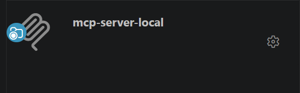
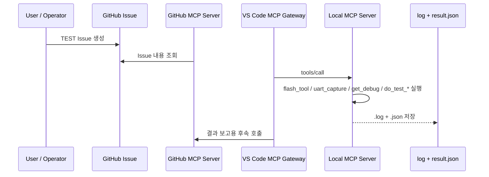

# Local MCP Server

* VSCode Extension -> MCP Servers              


## Overview

Local MCP Server는 **VS Code MCP Gateway**를 통해 연결되는 로컬 실행용 MCP Server이다.

현재 구조에서는 공통 코어(`mcp/server_local`) 위에 두 개의 진입점이 존재한다.

- `mcp-server-local-direct`: VS Code 또는 수동 실행용
- `mcp-server-local-runner`: GitHub Actions / self-hosted runner 실행용

현재 문서의 기준은 다음과 같다.

- OpenClaw는 사용하지 않는다
- 서버 등록과 실행은 `.vscode/mcp.json` 기준으로 설명한다
- 테스트 요청의 시작점은 `Tag Event`가 아니라 **GitHub Issue Event / TEST Issue 요청**이다
- 각 MCP Tool은 실행 결과를 **log 파일**과 **JSON 결과 파일**로 남긴다
- Tool 종류는 현재 운영 방향에 맞춰 최소 집합으로 유지한다

권장 흐름:

```text
GitHub Issue (TEST 요청)
  → GitHub MCP Server로 Issue 내용 확인
  → Local MCP Server Tool 실행
  → logs + results JSON 저장
  → GitHub Issue 댓글 또는 후속 문서로 보고
```

현재 구현 기준:

```text
GitHub Issue (TEST 요청)
  → GitHub Actions workflow 트리거
  → Python bridge (mcp.local_action_runner.run_test_request)
  → mcp-server-local-runner Tool 실행
  → results/log_mcp_server_local + results JSON 저장
```

---

## Current Direction

이 문서는 현재 구현 완료 상태를 모두 설명하는 문서라기보다,  
**VS Code 기반 Local MCP Server의 목표 운영 방식**을 정리한 문서다.

현재 저장소에서 실제로 자동 동작하는 경로는 다음과 같다.

1. GitHub Issue가 `test-request` 라벨과 함께 생성되거나 수정된다
2. GitHub Actions workflow가 `issues` 이벤트를 감지한다
3. self-hosted runner에서 Python bridge가 이슈 본문을 파싱한다
4. Python bridge가 `mcp.server_local_runner.server`를 호출한다
5. Local MCP Server가 로그와 JSON 결과를 저장한다

즉 현재 구현은 `GitHub Issue -> GitHub Actions -> Python bridge -> Local MCP Server` 구조다.

현재 코드 기준으로 일부 Tool은 stub이거나 축소 구현일 수 있다.  
문서의 초점은 다음 구조를 명확히 하는 데 있다.

1. VS Code가 MCP Server를 시작한다
2. GitHub Issue 기반으로 테스트 요청을 읽는다
3. Local MCP Tool이 실제 장치/로그/디버그 데이터를 수집한다
4. 각 Tool은 `.log`와 `.json` 결과를 남긴다
5. 이후 분석 또는 보고는 GitHub MCP와 연계해 처리한다

---

## MCP Server Local 

### Github Issue Trigger 


* **GitHub Issue 기반 TEST 요청**     
  1. 사용자는 [test_request.md](../../.github/issue_template/test_request.md) 템플릿으로 TEST 이슈생성    
      - [Github Template](../github/github_templates.md)    
  2. `Target Runner`, 테스트 종류, 장치/이미지, 반복 횟수, 제약 사항을 기록       
      - [Self-Hosted Runner](../github/self-hosted_runner.md)   
  3. AI Agent 또는 운영자가 GitHub MCP Server로 이슈 내용 분석   
  4. Local MCP Tool 실행    
  5. TEST 결과보고     
      - Result : Json 과 Log    
      - GitHub Issue 보고       


### Runner Assignment

여러 실행 주체가 있을 경우 `Target Runner` 값으로 담당 대상을 구분한다.

- 예: `local-dev`, `lab-node-01`, `qemu-runner`, `windows-host`
- 실행 주체는 자신에게 해당하는 `Target Runner` 요청만 처리한다
- 처리 시작 시 assignee 또는 label로 실행 중 상태를 표시할 수 있다


---

## VS Code Configuration

Local MCP Server는 `.vscode/mcp.json`으로 등록.   

예시:

```json
{
  "servers": {
    "mcp-server-local-direct": {
      "type": "stdio",
      "command": "C:\\Python314\\python.exe",
      "args": ["-X", "utf8", "-m", "mcp.server_local_direct.server"],
      "cwd": "${workspaceFolder}"
    }
  }
}
```

의미:

- VS Code가 `mcp-server-local-direct` 프로세스를 시작
- MCP `initialize`, `tools/list`, `tools/call`은 VS Code MCP Gateway를 통해 전달
- Tool discovery와 Tool 호출은 VS Code 내부 MCP 시스템이 처리

---

## Tool Set

문서 기준 Local MCP Server의 목표 Tool 집합.

| Tool | 목적 | 설명 |
|------|------|------|
| `flash_tool()` | 이미지 반영 | 장치 또는 대상 환경에 펌웨어/이미지 반영 |
| `uart_capture()` | UART 로그 수집 | 시리얼 포트 기반 런타임 로그 수집 |
| `get_debug()` | 디버그 정보 수집 | 디버그 덤프, 상태 정보, 추가 진단 데이터 수집 |
| `channels()` | 결과 전달 | GitHub 등 외부 채널로 결과 또는 알림 전달 |
| `do_test_<type>_<nn>()` | 테스트 실행 단위 | 특정 테스트 시나리오를 독립 Tool로 정의 |

설계 의도:

- Tool은 너무 크게 뭉치지 않고 역할별로 나눈다
- `do_test_<type>_<nn>()`는 실제 테스트 시나리오 단위를 표현한다
- `uart_capture()`와 `get_debug()`는 테스트 내부 또는 독립 단계에서 사용될 수 있다
- 결과 전달은 `channels()`가 담당한다

---

## Protocol Flow

현재 구현 요약:

```text
GitHub Issue
  → GitHub Actions
  → Python bridge
  → Local MCP Server
  → results/log_mcp_server_local + results JSON
```



실행 관점에서 보면:

1. GitHub Issue가 테스트 요청을 담는다
2. GitHub MCP Server가 요청 내용을 읽는다
3. VS Code MCP Gateway를 통해 Local MCP Tool이 호출된다
4. Local MCP Server는 로그와 JSON 결과를 저장한다
5. 이후 요약/분석/보고는 GitHub MCP와 연계한다

---

## Output Rules

각 Tool 실행 결과는 최소 두 가지 산출물을 남기는 것을 목표로 한다.

- **Log file**: 원시 실행 로그
- **JSON result file**: 구조화된 실행 결과 요약

### File Naming

| Tool | Log file | JSON result |
|------|----------|-------------|
| `flash_tool()` | `results/log_mcp_server_local/flash_<timestamp>.log` | `results/flash_<timestamp>.json` |
| `uart_capture()` | `results/log_mcp_server_local/uart_<timestamp>.log` | `results/uart_<timestamp>.json` |
| `get_debug()` | `results/log_mcp_server_local/debug_<timestamp>.log` | `results/debug_<timestamp>.json` |
| `do_test_<type>_<nn>()` | `results/log_mcp_server_local/test_<type>_<nn>_<timestamp>.log` | `results/test_<type>_<nn>_<timestamp>.json` |
| `channels()` | `results/log_mcp_server_local/channels_<timestamp>.log` | `results/channels_<timestamp>.json` |

### Result JSON Example

```json
{
  "tool": "do_test_uart_01",
  "timestamp": "2026-04-17T10:00:00Z",
  "status": "success",
  "exit_code": 0,
  "log_path": "results/log_mcp_server_local/test_uart_01_20260417T100000.log",
  "duration_ms": 1200,
  "context": {
    "target": "/dev/ttyUSB0",
    "issue_number": 12
  }
}
```

### Required Fields

| Field | Description |
|------|-------------|
| `tool` | 실행한 Tool 이름 |
| `timestamp` | 실행 시각 |
| `status` | `success` / `error` |
| `exit_code` | 프로세스 또는 실행 결과 코드 |
| `log_path` | 관련 로그 파일 경로 |
| `duration_ms` | 실행 시간 |
| `context` | Issue 요청 또는 테스트 파라미터 |

---

## Tool Definition Notes

### `flash_tool()`

- 목적: 테스트 대상 장치/환경에 이미지 반영
- 입력 예시: `image`, `interface`, `target`
- 출력: flash 로그 + flash 결과 JSON

### `uart_capture()`

- 목적: UART 기반 로그 수집
- 입력 예시: `port`, `baudrate`, `timeout`
- 출력: uart 로그 + uart 결과 JSON

### `get_debug()`

- 목적: 추가 디버그 정보 수집
- 예: 레지스터 상태, 진단 텍스트, 디버그 덤프, 상태 파일
- 출력: debug 로그 + debug 결과 JSON

### `channels()`

- 목적: 결과 전달 또는 알림 전송
- 예: GitHub Issue 댓글, Slack, 이메일
- 출력: channels 로그 + channels 결과 JSON

### `do_test_<type>_<nn>()`

- 목적: 구체적인 테스트 시나리오 1개를 독립 Tool로 정의
- 예: `do_test_uart_01`, `do_test_smoke_01`, `do_test_boot_01`
- 출력: 각 테스트별 로그 + 결과 JSON

이 naming 방식의 장점:

- 테스트 시나리오가 Tool 이름만으로 드러남
- GitHub Issue 요청과 테스트 결과를 쉽게 매핑 가능
- 이후 실패 패턴 분석과 문서화가 쉬움

---

## Agent Role

| Agent | Role | Access |
|------|------|--------|
| Local AI | 실행 전담 | `flash_tool`, `uart_capture`, `get_debug`, `do_test_*`, `channels` |
| Remote / Sub AI | 분석 및 보고 | JSON 결과와 로그를 읽고 요약/분석 |
| GitHub MCP | 요청/보고 연결 | Issue 조회, 댓글 작성, 상태 반영 |

---

## Practical Usage

현재 구조에서 현실적인 사용 예시는 아래와 같다.

1. GitHub에 `Test Request` 이슈 생성
2. 이슈에 대상 ref, 테스트 종류, 장치 정보 기록
3. GitHub MCP Server로 이슈 확인
4. Local MCP Server에서 필요한 Tool 실행
5. `results/log_mcp_server_local/`와 `results/`에 실행 결과 저장
6. GitHub MCP Server로 결과를 이슈에 댓글 또는 상태로 보고

---

## Related

- [mcp_gateway.md](mcp_gateway.md) — VS Code MCP Gateway와 다중 MCP Server 연결
- [mcp_server_github.md](mcp_server_github.md) — GitHub MCP Server 역할
- [test_request.md](../../.github/issue_template/test_request.md) — TEST 요청용 Issue 템플릿
