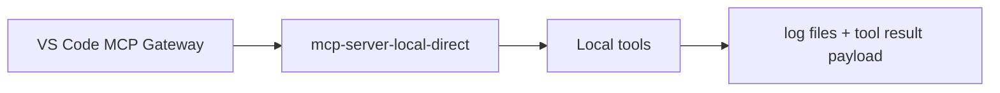
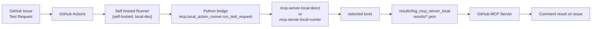

# Local MCP Server


## Overview

현재 저장소는 하나의 공통 Local MCP core 위에 두 개의 entrypoint를 사용.

- `mcp.server_local_direct.server`
- `mcp.server_local_runner.server`

공통 runtime 과 tool 정의는 `mcp/server_local/` 아래에 위치.

현재 기준 core file:

```text
mcp/
├── local_action_runner/
│   └── run_test_request.py
├── server_local/
│   ├── runtime.py
│   └── toolsets.py
├── server_local_direct/
│   └── server.py
└── server_local_runner/
    └── server.py
```

중요한 차이는 codebase 자체보다 시작 방식에 있음.

| Mode | Start | Main Context |
|------|------|--------------|
| `direct` | VS Code MCP 같은 local client 가 직접 시작 | local 개발, direct MCP TEST |
| `runner` | GitHub Actions issue flow 에서 self-hosted runner 를 통해 시작 | Github Issue 기반 TEST 자동화 |

---

## Current Flows-direct

이 경로는 GitHub Actions 나 self-hosted runner 가 필요 없음.

```text
VS Code MCP Gateway
  -> mcp-server-local-direct
  -> local MCP tools
  -> log files + tool result payload
```

주요 사용 목적:

- local 개발
- direct MCP client TEST
- manual tool 확인

Entrypoint:

- `python -m mcp.server_local_direct.server`

VS Code 설정 예시:

```json
{
  "servers": {
    "mcp-server-local-direct": {
      "type": "stdio",
      "command": "python",
      "args": ["-m", "mcp.server_local_direct.server"],
      "cwd": "${workspaceFolder}"
    }
  }
}
```

### Flow



---

## Current Flows-runner

이 경로는 GitHub Actions 와 self-hosted runner 가 필요.

```text
GitHub Issue
  -> GitHub Actions workflow
  -> Python bridge (mcp.local_action_runner.run_test_request)
  -> mcp-server-local-direct or mcp-server-local-runner
  -> results/log_mcp_server_local + results/*.json
  -> GitHub Issue comment
```

현재 workflow:

- `.github/workflows/test_request_local.yaml`

현재 runner requirement:

- `runs-on: [self-hosted, local-dev]`

즉 issue 기반 TEST 흐름은 일치하는 self-hosted runner 가 online 상태일 때만 동작.

중요:

- `server_local_direct` 자체는 GitHub Actions 없이도 실행 가능
- 하지만 `Issue -> Action -> result comment` 경로는 workflow 가 self-hosted runner 에서 돌기 때문에 runner 가 필요

### Flow



---

## Flow Decision

`direct` 사용 시점:

- VS Code 또는 local client 에서 Local MCP Server 를 직접 실행하고 싶을 때
- GitHub Issue 자동화가 필요 없을 때
- server 자체를 빠르게 검증하고 싶을 때

issue 기반 runner flow 사용 시점:

- GitHub Test Request issue 로 실행을 시작하고 싶을 때
- 결과를 artifact, JSON, log, issue comment 로 남기고 싶을 때
- 요청을 특정 self-hosted runner 로 라우팅하고 싶을 때

---

## Test Request Flow

현재 자동 TEST Request 흐름:

```text
GitHub Issue
  -> test_request_local.yaml
  -> mcp.local_action_runner.run_test_request
  -> selected local MCP server
  -> selected tools
  -> results JSON + log files
  -> GitHub Issue result comment
```

### Request Source

issue body format source:

- `.github/issue_template/test_request.md`

현재 template 주요 항목:

- `Template Version`
- `Branch / Tag / Commit`
- `Target Runner`
- `MCP Server Mode`
- 하나 이상의 선택된 tool
- `Test Type`
- `Target Device / Image`
- `Iterations`

관련 문서:

- [github_templates.md](../github/github_templates.md)

### Python Bridge

bridge script:

- `mcp/local_action_runner/run_test_request.py`

역할:

1. issue body parsing
2. `MCP Server Mode` 검증
3. `runner` mode 일 때 Target Runner 검증
4. 선택된 tool 목록 해석
5. Local MCP Server subprocess 실행
6. 요청된 tool 호출
7. result JSON 저장
8. workflow 가 최종 issue comment 를 달 수 있도록 결과 제공

### Server Resolution

현재 resolution logic:

- `direct` -> `mcp.server_local_direct.server`
- `runner` -> `mcp.server_local_runner.server`

현재 server name:

- `mcp-server-local-direct`
- `mcp-server-local-runner`

---

## Tool Execution

현재 tool set 정의 위치:

- `mcp/server_local/toolsets.py`

현재 지원 tool:

- `build_tool`
- `flash_tool`
- `log_analyzer`

Test Request template 은 한 issue 에서 하나 이상의 tool 선택을 허용.

Python bridge 는 선택된 tool 을 순서대로 실행하고, 결과를 하나의 JSON 에 저장.

전체 status 규칙:

- `success` if all selected tools succeed
- `error` if any selected tool fails

---

## Outputs

현재 output directory:

- `results/log_mcp_server_local/`
- `results/`

현재 runtime log:

- `results/log_mcp_server_local/mcp-server-local.log`
- `results/log_mcp_server_local/mcp-server-local-build_tool.log`
- `results/log_mcp_server_local/mcp-server-local-flash_tool.log`
- `results/log_mcp_server_local/mcp-server-local-log_analyzer.log`

현재 issue result JSON:

- `results/issue-test-request-<issue_number>.json`

현재 result JSON 주요 항목:

- request metadata
- template version
- resolved MCP server
- selected tools
- tool 별 실행 결과
- tool 별 log path

workflow 는 이 파일을 artifact 로 업로드하고, formatting 된 comment 를 issue 에 남김.

---

## Current Limitations

현재 구현은 의도적으로 작고 TEST 중심.

- tool 상당수는 stub 성격이 강함
- log file 이름은 실행 timestamp 기준이 아니라 tool 이름 기준 공유 방식
- issue comment 는 workflow script 가 생성
- issue 기반 flow 는 self-hosted runner online 상태에 의존

즉 현재 시스템은 다음처럼 이해하는 편이 맞음.

- practical 한 Local MCP Server 기반
- GitHub Issue 기반 TEST harness
- 이후 실제 build, flash, log analysis 동작을 확장할 자리

---

## Related Files

- [mcp_gateway.md](mcp_gateway.md)
- [mcp_server_github.md](mcp_server_github.md)
- [github_templates.md](../github/github_templates.md)
- [self-hosted_runner.md](../github/self-hosted_runner.md)
- [test_request.md](../../.github/issue_template/test_request.md)
