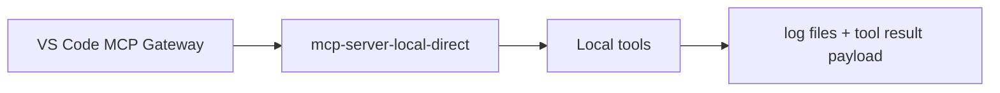
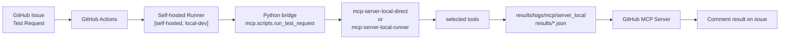

# Local MCP Server


로컬 환경에서 사용하는 MCP Server 구조와 GitHub Issue 기반 Test Request 흐름을 정리한 문서다.

## Overview

현재 저장소는 하나의 공통 Local MCP core 위에 두 개의 entrypoint를 둔다.

- `mcp.server_local_direct.server`
- `mcp.server_local_runner.server`

공통 runtime 과 tool 정의는 `mcp/server_local/` 아래에 있다.

```text
mcp/
├── scripts/
│   ├── make_test_result.py
│   └── run_test_request.py
├── server_local/
│   ├── runtime.py
│   └── toolsets.py
├── server_local_direct/
│   └── server.py
└── server_local_runner/
    └── server.py
```

핵심 차이는 codebase 가 아니라 시작 방식이다.

| Mode | Start | Main Context |
|------|------|--------------|
| `direct` | VS Code MCP client 가 직접 실행 | 로컬 개발, direct MCP test |
| `runner` | GitHub Actions issue flow 에서 self-hosted runner 를 통해 실행 | GitHub Issue 기반 자동 test |

---

## Current Flows - direct

이 경로는 GitHub Actions 나 self-hosted runner 가 필요 없다.

```text
VS Code MCP Gateway
  -> mcp-server-local-direct
  -> local MCP tools
  -> log files + tool result payload
```

주요 목적:

- 로컬 개발
- direct MCP client test
- manual tool 확인

Entrypoint:

- `python -m mcp.server_local_direct.server`

VS Code 설정 예시:

```json
{
  "servers": {
    "mcp-server-local-direct": {
      "type": "stdio",
      "command": "python",
      "args": ["-m", "mcp.server_local_direct.server"],
      "cwd": "${workspaceFolder}"
    }
  }
}
```

### Flow



---

## Current Flows - runner

이 경로는 GitHub Actions 와 self-hosted runner 가 필요하다.

```text
GitHub Issue
  -> GitHub Actions workflow
  -> Python bridge (mcp.scripts.run_test_request)
  -> mcp-server-local-direct or mcp-server-local-runner
  -> results/logs/mcp/server_local + results/*.json
  -> GitHub Issue comment
```

현재 workflow:

- `.github/workflows/test_request_local.yaml`

현재 runner requirement:

- `runs-on: [self-hosted, local-dev]`

즉 issue 기반 test 요청은 `local-dev` 라벨을 가진 self-hosted runner 가 online 상태일 때 동작한다.

중요한 점:

- `server_local_direct` 자체는 GitHub Actions 없이도 실행 가능
- 하지만 `Issue -> Action -> result comment` 경로는 workflow 가 self-hosted runner 위에서 동작하므로 runner 가 필요

### Flow



---

## Flow Decision

`direct` 를 쓰는 경우:

- VS Code 나 local client 에서 Local MCP Server 를 직접 띄우고 싶을 때
- GitHub Issue 자동화가 필요 없을 때
- server 자체를 빠르게 검증하고 싶을 때

issue 기반 runner flow 를 쓰는 경우:

- GitHub Test Request issue 로 실행을 시작하고 싶을 때
- 결과를 artifact, JSON, log, issue comment 로 남기고 싶을 때
- 특정 self-hosted runner 로 라우팅하고 싶을 때

---

## Test Request Flow

현재 자동 Test Request 흐름:

```text
GitHub Issue
  -> test_request_local.yaml
  -> mcp.scripts.run_test_request
  -> selected local MCP server
  -> selected tools
  -> results JSON + log files
  -> GitHub Issue result comment
```

### Request Source

issue body format source:

- `.github/ISSUE_TEMPLATE/test_request_direct.yml`
- `.github/ISSUE_TEMPLATE/test_request_runner.yml`

현재 template 주요 항목:

- `Template Version`
- `Target Runner`
- `Branch / Tag / Commit`
- category checklist
  - `Setup Tools Checklist`
  - `Test Tools Checklist`
  - `Log Tools Checklist`

관련 문서:

- [github_templates.md](../github/github_templates.md)

### Python Bridge

bridge script:

- `mcp/scripts/run_test_request.py`

역할:

1. issue body parsing
2. `MCP Server Mode` 검증
3. `runner` mode 일 때 `Target Runner` 검증
4. 체크된 category 와 tool 목록 해석
5. Local MCP Server subprocess 실행
6. MCP tool 호출
7. result JSON 저장
8. workflow 가 최종 issue comment 를 달 수 있도록 결과 제공

실행 방식:

- `run_test_request.py` 는 tool 을 직접 실행하지 않음
- `resolve_server_module()` 로 선택된 mode 에 따라 server module 결정
- `direct` 면 `mcp.server_local_direct.server`
- `runner` 면 `mcp.server_local_runner.server`
- 이후 `call_local_mcp()` 에서 `python -m <server module>` 형태로 subprocess 실행
- 표준입력(stdin) 으로 JSON-RPC 요청 전달
- 요청 순서:
  - `initialize`
  - `notifications/initialized`
  - `tools/list`
  - `tools/call`
- 표준출력(stdout) 으로 반환된 `tools/call` 응답을 파싱해서 결과 JSON 과 issue comment payload 생성

즉 실제 runner flow 는 다음처럼 동작한다.

```text
run_test_request.py
  -> mcp.server_local_runner.server subprocess 실행
  -> JSON-RPC 요청 전송
  -> tool execution result 수신
  -> results/Github-ISSUE-TR-<issue_number>.json 저장
```


### Server Resolution

현재 resolution logic:

- `direct` -> `mcp.server_local_direct.server`
- `runner` -> `mcp.server_local_runner.server`

현재 server name:

- `mcp-server-local-direct`
- `mcp-server-local-runner`

---

## Tool Execution

현재 tool set 정의 위치:

- `mcp/server_local/toolsets.py`

현재 tool catalog 는 category 기반으로 관리된다.

- `setup`
- `test`
- `log`

예시 tool:

- `check_version`
- `setup_python`
- `flash_tool`
- `test_ping_00`
- `test_ping_11`
- `test_ping_22`
- `get_serial_log`
- `log_analyzer`
- `log_snapshot`

Test Request template 은 한 issue 에서 하나의 category 만 선택하도록 설계되어 있다.

Python bridge 는 체크된 category 안의 tool 들을 순서대로 실행하고, 결과를 하나의 JSON 에 저장한다.

전체 status 규칙:

- 모든 tool 이 성공하면 `success`
- 하나라도 실패하면 `error`

---

## Outputs

현재 output directory:

- `results/logs/mcp/server_local/`
- `results/`

현재 runtime log 예시:

- `results/logs/mcp/server_local/runner.log`
- `results/logs/mcp/server_local/runner-check_version.log`
- `results/logs/mcp/server_local/runner-flash_tool.log`
- `results/logs/mcp/server_local/runner-log_analyzer.log`

현재 issue result JSON:

- `results/Github-ISSUE-TR-<issue_number>.json`

현재 result JSON 주요 항목:

- request metadata
- template version
- resolved MCP server
- selected tools
- tool 별 실행 결과
- tool 별 log path

workflow 는 이 파일을 artifact 로 업로드하고, formatting 후 issue comment 를 작성한다.

---

## Current Limitations

현재 구현은 테스트 중심의 local harness 성격이 강하다.

- 일부 tool 은 stub 구현
- log file naming 은 timestamp 기반이 아니라 tool name 기반
- issue comment formatting 은 workflow script 에서 수행
- issue 기반 flow 는 self-hosted runner availability 에 의존

즉 현재 포지션은 다음처럼 보는 것이 맞다.

- practical 한 Local MCP Server 기반
- GitHub Issue 기반 test harness
- 이후 실제 build, flash, log analysis 동작으로 확장 가능한 구조

---

## Related Files

- [mcp_gateway.md](mcp_gateway.md)
- [mcp_server_github.md](mcp_server_github.md)
- [github_templates.md](../github/github_templates.md)
- [self-hosted_runner.md](../github/self-hosted_runner.md)
- [test_request_direct.yml](../../.github/ISSUE_TEMPLATE/test_request_direct.yml)
- [test_request_runner.yml](../../.github/ISSUE_TEMPLATE/test_request_runner.yml)
