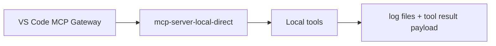
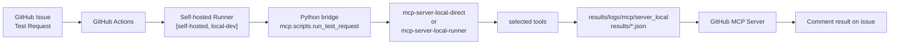
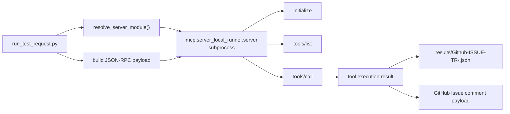

# Local MCP Server


## Overview

This document describes the Local MCP Server structure used in the local environment and the GitHub Issue based TEST request flow.

Current repository design:

- one shared Local MCP core
- two entrypoints
  - `mcp.server_local_direct.server`
  - `mcp.server_local_runner.server`

Shared runtime and tool definitions are under `mcp/server_local/`.

```text
mcp/
  scripts/
    make_test_result.py
    run_test_request.py
  server_local/
    runtime.py
    toolsets.py
  server_local_direct/
    server.py
  server_local_runner/
    server.py
```

The key difference is the startup path, not the codebase.

| Mode | Start | Main Context |
|------|------|--------------|
| `direct` | started directly by a VS Code MCP client | local development, direct MCP test |
| `runner` | started through the GitHub Actions Issue flow on a self-hosted runner | GitHub Issue based automated test |

---

## Current Flows - direct

This path does not require GitHub Actions or a self-hosted runner.

```text
VS Code MCP Gateway
  -> mcp-server-local-direct
  -> local MCP tools
  -> log files + tool result payload
```

Main purpose:

- local development
- direct MCP client test
- manual tool verification

Entrypoint:

- `python -m mcp.server_local_direct.server`

VS Code configuration example:

```json
{
  "servers": {
    "mcp-server-local-direct": {
      "type": "stdio",
      "command": "python",
      "args": ["-m", "mcp.server_local_direct.server"],
      "cwd": "${workspaceFolder}"
    }
  }
}
```

### Flow



---

## Current Flows - runner

This path requires GitHub Actions and a self-hosted runner.

```text
GitHub Issue
  -> GitHub Actions workflow
  -> Python bridge (mcp.scripts.run_test_request)
  -> mcp-server-local-direct or mcp-server-local-runner
  -> results/logs/mcp/server_local + results/*.json
  -> GitHub Issue comment
```

Current workflow:

- `.github/workflows/test_request_local.yaml`

Current runner requirement:

- `runs-on: [self-hosted, local-dev]`

This means Issue-based test requests work only when a self-hosted runner with the `local-dev` label is online.

Important points:

- `server_local_direct` can run without GitHub Actions
- however, the `Issue -> Action -> result comment` path requires a self-hosted runner because the workflow executes there

### Flow



---

## Flow Decision

Use `direct` when:

- a VS Code or local client should start the Local MCP Server directly
- GitHub Issue automation is not needed
- the server should be verified quickly

Use the Issue-based runner flow when:

- execution should start from a GitHub TEST Request Issue
- results should remain as artifact, JSON, log, and Issue comment
- routing to a specific self-hosted runner is required

---

## Test Request Flow

Current automated TEST Request flow:

```text
GitHub Issue
  -> test_request_local.yaml
  -> mcp.scripts.run_test_request
  -> selected local MCP server
  -> selected tools
  -> results JSON + log files
  -> GitHub Issue result comment
```

### Request Source

Issue body format source:

- `.github/ISSUE_TEMPLATE/test_request_direct.yml`
- `.github/ISSUE_TEMPLATE/test_request_runner.yml`

Current template fields:

- `Template Version`
- `Target Runner`
- `Branch / Tag / Commit`
- category checklist
  - `Setup Tools Checklist`
  - `Test Tools Checklist`
  - `Log Tools Checklist`

Reference:

- [GitHub Templates](../envs/github_templates.md)

### Python Bridge

Bridge script:

- `mcp/scripts/run_test_request.py`

Role:

1. parse Issue body
2. validate `MCP Server Mode`
3. validate `Target Runner` when mode is `runner`
4. resolve checked category and tool list
5. start the Local MCP Server subprocess
6. call MCP tools
7. save result JSON
8. provide output for the final Issue comment step

Execution model:

- `run_test_request.py` does not execute tools directly
- `resolve_server_module()` selects the server module from the mode
- `direct` maps to `mcp.server_local_direct.server`
- `runner` maps to `mcp.server_local_runner.server`
- `call_local_mcp()` starts `python -m <server module>` as a subprocess
- JSON-RPC requests are sent over `stdin`
- request order:
  - `initialize`
  - `notifications/initialized`
  - `tools/list`
  - `tools/call`
- `stdout` is parsed to build the result JSON and Issue comment payload

Practical runner flow:

```text
run_test_request.py
  -> start mcp.server_local_runner.server as subprocess
  -> send JSON-RPC request
  -> receive tool execution result
  -> write results/Github-ISSUE-TR-<issue_number>.json
```



### Server Resolution

Current resolution logic:

- `direct` -> `mcp.server_local_direct.server`
- `runner` -> `mcp.server_local_runner.server`

Current server names:

- `mcp-server-local-direct`
- `mcp-server-local-runner`

---

## Tool Execution

Current tool set definition:

- `mcp/server_local/toolsets.py`

Current tool catalog structure:

- `setup`
- `test`
- `log`

Example tools:

- `check_version`
- `setup_python`
- `flash_tool`
- `test_ping_00`
- `test_ping_11`
- `test_ping_22`
- `get_serial_log`
- `log_analyzer`
- `log_snapshot`

The TEST Request template is designed so that one Issue selects one category at a time.

The Python bridge runs the tools from the checked category in sequence and stores the combined result in one JSON file.

Status rule:

- `success` if all tools succeed
- `error` if any tool fails

---

## Outputs

Current output directories:

- `results/logs/mcp/server_local/`
- `results/`

Current runtime log examples:

- `results/logs/mcp/server_local/runner.log`
- `results/logs/mcp/server_local/runner-check_version.log`
- `results/logs/mcp/server_local/runner-flash_tool.log`
- `results/logs/mcp/server_local/runner-log_analyzer.log`

Current Issue result JSON:

- `results/Github-ISSUE-TR-<issue_number>.json`

Current result JSON fields:

- request metadata
- template version
- resolved MCP server
- selected tools
- per-tool execution result
- per-tool log path

The workflow uploads this file as an artifact and then formats it into an Issue comment.

---

## Current Limitations

The current implementation is still closer to a test-focused local harness.

- some tools are stubs
- log file naming is tool-name based, not timestamp based
- Issue comment formatting is handled by the workflow script
- Issue-based flow depends on self-hosted runner availability

Current position:

- practical Local MCP Server base
- GitHub Issue based test harness
- expandable to real build, flash, and log analysis behavior

---

## Related Files

- [MCP Gateway](mcp_gateway.md)
- [MCP Server-GitHub](mcp_server_github.md)
- [GitHub Templates](../envs/github_templates.md)
- [GitHub Self Hosted Runner](../envs/github_self_hosted_runner.md)
- `.github/ISSUE_TEMPLATE/test_request_direct.yml`
- `.github/ISSUE_TEMPLATE/test_request_runner.yml`
